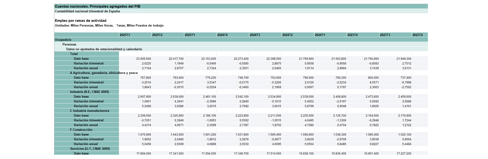
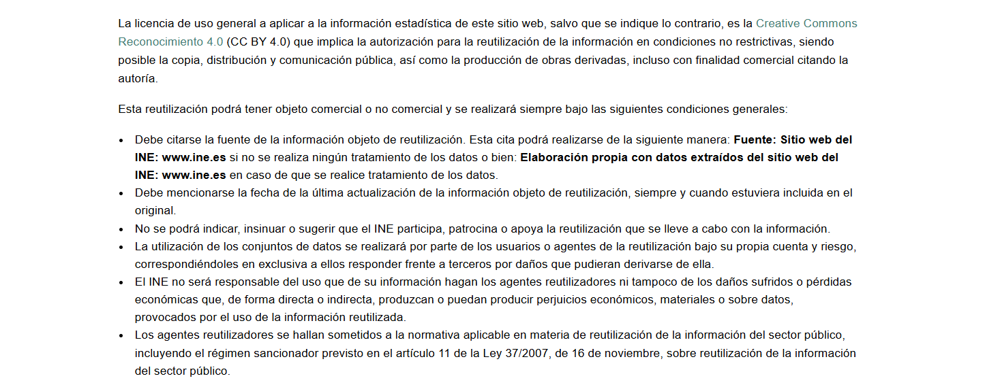
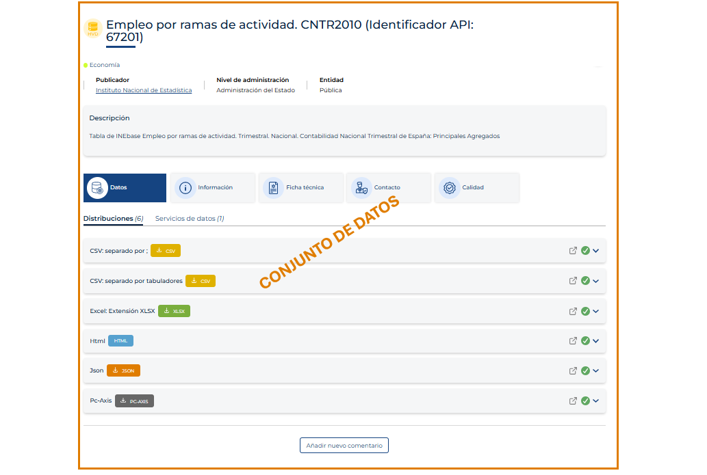
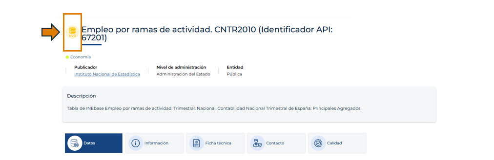
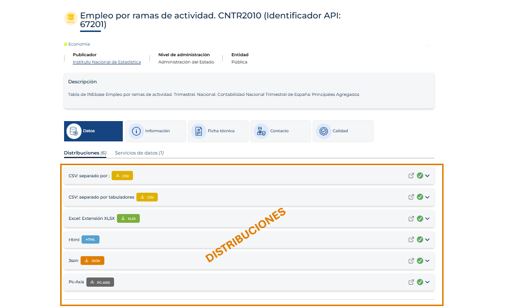
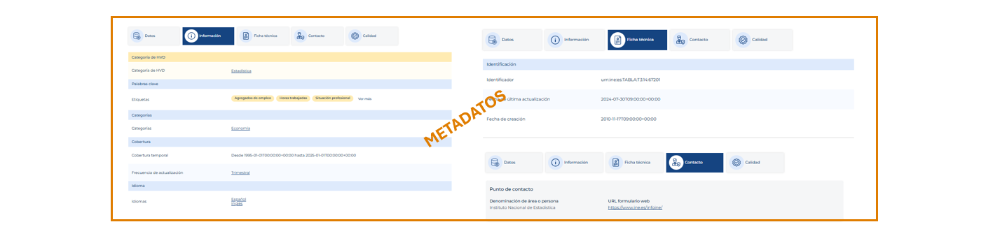

<!--
module_id: unidad-formativa-01
author: Equipo gestor de la plataforma datos.gob.es
email: contacto@datos.gob.es
date: 09/06/2026
version: 0.1.0.0
language: es
narrator: Spanish Female
mode: Textbook
title: Unidad 07b - Visualización de datos
comment: Esta unidad presenta los conceptos básicos, historia y tipos de visualización de datos. 
long_description: Unidades didácticas. Unidad 07 - Visualización de datos. Más información en [datos.gob.es](https://datos.gob.es/)

edit: true

repository: https://github.com/datosgobes/unidad-formativa-07b

logo:     https://cdn.jsdelivr.net/gh/datosgobes/unidad-formativa-00@main/assets/img/logo_dge_square.svg

icon:     https://cdn.jsdelivr.net/gh/datosgobes/unidad-formativa-00@main/assets/img/logo_conjunto.png

dark:   false

link: https://fonts.googleapis.com/css2?family=Montserrat:ital,wght@0,100..900;1,100..900&display=swap
      https://raw.githack.com/datosgobes/unidad-formativa-00/refs/heads/main/assets/css/dge-styles.css

font: Montserrat

attribute: Iniciativa de datos abiertos del Gobierno de España [CC BY 4.0](https://creativecommons.org/licenses/by/4.0/)
-->

# Unidad 07b - Visualización de datos

Esta unidad didáctica ofrece una visión general de la **visualización de datos contemporánea**, una **breve historia** de la visualización y los **tipos de visualización** más utilizados y útiles hoy en día. 

Para consolidar lo aprendido, contarás con **ejercicios** en cada bloque, un **cuestionario final** y un **resumen** que recogerá las ideas más importantes.

Para comenzar, te invitamos a ver un breve **vídeo introductorio** que ofrece una visión general de los conceptos fundamentales que exploraremos a lo largo de los distintos apartados. Este recurso audiovisual te permitirá situarte en el tema, comprender su importancia y anticipar las ideas clave que desarrollaremos con mayor profundidad.

**¡Adelante!**

!?[Vídeo descriptivo de la unidad](https://youtu.be/LAe0MN-A0FQ?si=IqDVUYPjhPmGXI4W)

También puedes ver la [versión en inglés](https://www.youtube.com/watch?v=S1Rvfu5mqfc)<!-- style="target: _blank" --> del vídeo

 

---

## Información inicial

{{|>}}
*************************************************************************************************************

  
  

    
📌

Título: Tipos y herramientas para la visualización de datos. 

  

  

    
📋

Descripción: La unidad describe todos los elementos que hay que abordar a la hora de realizar una visualización de datos, desde el procesamiento de los datos de entrada para disponer del formato adecuado hasta a la capa de presentación para poder acceder a la visualización en un entorno web;finaliza con una revisión de los tipos más frecuentes de visualización contemporánea que podemos utilizar. En cada paso se recomiendan una serie de herramientas, siempre gratuitas y de acceso libre, a las que podemos recurrir para realizar las visualizaciones. .

  

  

    
👥

Público objetivo: 
		Esta unidad didáctica está orientada a toda aquella persona que desee iniciarse en el mundo de la visualización contemporánea y que tenga interés en aprender todo el espectro de posibilidades que ofrecen las herramientas actuales. Esto incluye a aquellos interesados tanto en difundir datos de impacto social como a aquellos en entornos profesionales que utilicen datos abiertos. Las categorías profesionales que pueden beneficiarse de los contenidos de este curso son:   analistas de datos, periodistas de datos, desarrolladores, programadores, diseñadores gráficos e ilustradores, entre otros. 

  

  

    
🎓

Conocimientos previos:Esta unidad didáctica arranca desde los principios básicos de la visualización por lo cual puede ser seguida adecuadamente por cualquier usuario. No obstante, para el tratamiento de datos inicial, el manejo de un lenguaje de programación como R o Python es recomendable. Para la creación de proyectos de visualización se ofrecen toda una serie de herramientas desde muy básicas a más complejas. Asimismo, la familiaridad con lenguajes como JavaScript puede ayudar para el desarrollo de visualizaciones y frontales web que alberguen esas visualizaciones.

  

  

    

      

🎯

Objetivos

      
      

	  Los objetivos didácticos que cubre esta unidad didáctica son: 
- Introducir **históricamente** el ámbito de la visualización de datos, explicando los motivos por los cuales empleamos visualizaciones y qué es la visualización contemporánea. 
- Proporcionar **herramientas básicas** al analista de datos, periodista, desarrollador, programador, diseñador gráfico o ilustrador que desee iniciarse en el mundo de la visualización de datos contemporánea. 
- Explicar los **formatos de datos** más populares que se utilizan en la actualidad para visualizar datos en entornos web, así como su adecuación según la tecnología que empleada y del tipo de visualización. 
- Introducir las **cuatro grandes familias de visualización contemporánea**: representación de magnitudes, series temporales,  elementos interconectados y mapas y cartografía
      

    

    

      

📑

Contenidos

      
      

1. Introducción
   - Breve historia de la visualización de datos
   - Impacto social y empresarial de la visualización
   - Perfil del desarrollador de visualizaciones de datos
2. Tipos y herramientas
   2.1 Formatos de datos para visualización
    - CSV, TSV, TXT
    - JSON
    - GoogleSheets
	2.2 Tipos de visualizaciones
	- Magnitudes
	- Series Temporales
 	- Redes y Jerarquías
 	- Cartografía y Mapas
3. Frontales web
   3.1 HTML y CSS
	3.2 Javascript
   3.3 Observable
      

    

  

  

	

		⚠️ Aviso
	

	

El desembarco de nuevas tecnologías a lo largo de las últimas décadas no ha desbancado la creación de piezas de visualización artesanas, hechas fuera del mundo digital. Estas emplean todo tipo de materiales y técnicas que también se benefician de otros avances tecnológicos, y  permiten llegar al público de forma muy efectiva e impactante.
	

	

		💡 Ejemplo
	

	

El proyecto ShowYourStripes aborda el incremento de la temperatura a través de líneas de color. Este proyecto cuenta con representación en todo tipo de soportes más allá de los digitales. 

https://showyourstripes.info/showcase 
	

  

    
🔍

Guía de uso: en la <a href="https://liascript.github.io/course/?https://raw.githubusercontent.com/datosgobes/unidad-formativa-00/main/CURSO.md#1" target="_blank" rel="noopener">Unidad 00</a> encontrarás información sobre las funcionalidades de las unidades, la estructura global, como reutilizar los materiales, etc.

  

  

    
🏷️

Versión de la unidad: v1.0.0

  

  

    Empieza el curso o descarga la documentación
    

      <a href="https://github.com/datosgobes/unidad-formativa-01/releases/download/latest/documentation-unidad-formativa-01.pdf" target="_blank" rel="noopener" class="botones_doc">📄 PDF</a>
      <a href="https://github.com/datosgobes/unidad-formativa-01/releases/download/latest/scorm-unidad-formativa-01.zip" target="_blank" rel="noopener" class="botones_doc">📦 SCORM</a>
      <a href="https://github.com/datosgobes/unidad-formativa-01/releases/download/latest/ims-unidad-formativa-01.zip" target="_blank" rel="noopener" class="botones_doc">📚 IMS</a>
    

  

*************************************************************************************************************

<!-- id="historia_0" -->
## Introducción

### Breve historia de la visualización de datos

{{|>}}
*************************************************************************************************************

La visualización existe probablemente desde antes incluso del desarrollo de la escritura y de los primeros sistemas alfabéticos por la humanidad. La representación de las estrellas en el firmamento, y, posteriormente, el desarrollo de cartografías en el plano terrestre fueron probablemente las primeras trazas de visualización que desarrolló el ser humano. 

Ejemplo: En la Figura 1 se puede observar la distribución de estrellas de la constelación de Pegaso realizada por Johann Bayer en 1603, un ejemplo que recoge la práctica milenaria de referenciarnos dentro del espacio y el universo. 

*************************************************************************************************************

<!-- id="historia_1" -->

### Breve historia de la visualización de datos

{{|>}}
*************************************************************************************************************

La observación astronómica trae consigo, de hecho, uno de los mayores giros conceptuales en la percepción que ha hecho el ser humano del conocimiento.

Ejemplo: En 1694 Galileo Galilei publica su obra sobre la posición de las estrellas no visibles a simple vista gracias al uso de telescopios, al comienzo del desarrollo y uso de tales artilugios (Figura 2). 

La información que se escondía en la bóveda celeste -y que se revela a través del telescopio- da pistas sobre un orden y una profundidad de conocimiento que, por entonces, solo era explorada de forma abstracta por creencias y religiones. Galileo enuncia el concepto de Oculata Certitudine, es decir, el hecho de que la verdad está en la observación de lo que vemos, una idea que anidó entonces en la sociedad occidental hasta nuestros días, y que se considera precursora del método científico y del desarrollo tecnológico. De esta forma, la verdad queda vinculada explícitamente al sentido visual. 

*************************************************************************************************************

<!-- id="historia_2" -->

### Breve historia de la visualización de datos

{{|>}}
*************************************************************************************************************

Con el avance científico, matemático y estadístico en los siglos posteriores se llega a creación de las primeras tablas en formato impreso, ricas en contenido, pero difíciles de interpretar a simple vista.Es en ese momento cuando surge la visualización moderna, utilizando los ejes cartesianos X e Y para la representación de información. No será hasta la segunda mitad del siglo XIX cuando la visualización contemporánea, tal y como la conocemos, comienza a consolidarse. 

Ejemplos: 

- Trabajos como los de Florence Nightingale, con todo su análisis estadístico de mortandad en la guerra de Crimea (Figura 3). 
- Charles Minard describiendo la sangrienta campaña en el frente ruso de las tropas napoleónicas (Figura 4). 
- W.E.B. duBois  (Figura 5) y sus estadísticas de la realidad socioeconómica de la población afroamericana tras la ilegalización de la esclavitud.

Todos ellos pusieron la visualización a otro nivel, tanto en lo relativo al rigor numérico y citación de fuentes como en la adopción de una aproximación gráfica y estética absolutamente rupturista con el clasicismo de los ejes cartesianos de los siglos anteriores.

! Mapa figurativo de la campaña napoleónica en Rusia, Charles Minard ,1869.](media/minard.jpg "Figura. Mapa figurativo de la campaña napoleónica en Rusia, Charles Minard ,1869. Fuente: [Beautiful Evidence, Edward R. Tufte, 2006]")

*************************************************************************************************************

<!-- id="historia_3" -->

### Breve historia de la visualización de datos

{{|>}}
*************************************************************************************************************

De esta forma se llega al siglo XX, donde las grandes tiradas de prensa popularizan definitivamente el uso de la visualización de datos y ésta pasa a formar parte de muchas de las narrativas periodísticas. El siglo XXI trae consigo la irrupción de Internet y el aumento de la capacidad de cálculo de los circuitos integrados basados en materiales semiconductores, ofreciendo potentes herramientas tanto de análisis como de visualización desplegando un universo de posibilidades impensables hace unas décadas, tanto de volumen de datos como de creatividad. 

  

	

		⚠️ Aviso
	

	

La revolución digital ha traído consigo,no solo el desarrollo de potentes herramientas de cálculo y diseño, sino también dispositivos electrónicos que basan su interacción con el ser humano, en gran medida, en lo visual a través de pantallas táctiles. Este fenómeno ha predispuesto a los usuarios a consumir información visual por encima de cualquier otro tipo de formatos, favoreciendo el uso de visualizaciones frente a la lectura atenta de texto. La visualización de datos se ve así impulsada por estos dispositivos y encuentra su lugar en la actualidad gracias a contar con un público habituado a consumir información visual. 
	

*************************************************************************************************************

<!-- id="conceptos-clave" -->
## Conceptos clave

{{|>}}
*************************************************************************************************************

Como punto de partida se definen los conceptos básicos que se manejan al hablar de datos en general y de datos abiertos en particular. Se toma como referencia el marco legislativo vigente en España.

")

*************************************************************************************************************

### Bloque I: conceptos básicos

{{|>}}
*************************************************************************************************************

		Dato

**Toda representación digital de actos, hechos o información, así como su recopilación, incluso como grabación sonora, visual o audiovisual. 📖 [ Fuente](https://www.boe.es/buscar/act.php?id=BOE-A-2010-1331)**

Los datos pueden ser **estructurados** y **no estructurados**:

- **Estructurados**: tienen bien definidos su longitud y su formato, como las fechas, los números o las cadenas de caracteres. Se almacenan en tablas. Un ejemplo son las bases de datos relacionales y las hojas de cálculo. 
- **No estructurados**: carecen de un formato específico. No se pueden almacenar dentro de una tabla, ya que su información no se puede desgranar en tipos básicos de datos. Algunos ejemplos son los ficheros PDF, archivos multimedia, e-mails, documentos de texto, etc.

Los datos se convierten en **información** cuando se les proporciona un contexto. El **conocimiento** es lo que se obtiene de la información cuando esta información se personaliza en función de nuestra experiencia y valores.

	

		💡 Ejemplo
	

	

- **Dato:** 15°C.  

  Es un valor aislado, sin contexto. Solo sabemos que es una temperatura.
- **Información:** La temperatura en Valladolid hoy es de 15°C.  

  El dato se contextualiza: sabemos dónde y cuándo se aplica.
- **Conocimiento:** Si la temperatura en Valladolid es de 15°C en enero, es inusualmente alta.  

  Se interpreta la información, se relaciona con experiencia y se extraen conclusiones útiles.
	

")

		Datos abiertos

**Cualquiera es libre de utilizar, reutilizar y redistribuir, con el único límite, en su caso, del requisito de atribución de su fuente o el reconocimiento de su autoría. 📖[ Fuente](https://www.boe.es/buscar/act.php?id=BOE-A-2007-19814)**

Esta definición identifica tres características esenciales:

- **Uso libre**: pueden emplearse para cualquier finalidad, incluida la comercial.
- **Reutilización**: posibilidad de transformar, combinar o enriquecer los datos.
- **Redistribución**: posibilidad de compartir datos originales o derivados.

")

	

		⚠️ Aviso
	

	

			En la práctica, esto significa que:

		  - Un ayuntamiento publica sus presupuestos anuales como datos abiertos: ciudadanos y periodistas pueden analizarlos.
			 - El Ministerio de Transportes ofrece datos de tráfico en tiempo real: desarrolladores crean aplicaciones de movilidad.
			 - El Instituto Nacional de Estadística publica datos demográficos: investigadores los usan para estudios socioeconómicos.
	

**Lo que NO son datos abiertos**

- Datos publicados sin licencia clara (genera inseguridad jurídica).
- Datos accesibles solo previo registro o pago.
- Datos con restricciones de privacidad o seguridad (ej: datos personales).

		Licencia abierta

**Acuerdo legal que otorga permisos de libre uso, modificación y distribución de un recurso, exigiendo únicamente el reconocimiento del autor y la continuidad de la propia licencia abierta. **

Las licencias Creative Commons (CC) es el ejemplo más popular para contenidos y datos, y en concreto, las mostradas en este esquema, las más habituales en el contexto de los datos abiertos.

")

	

		💡 Ejemplo
	

	

			El Instituto Geográfico Nacional ofrece información geográfica digital de España reutilizable y gratuita bajo una licencia **CC-BY 4.0.** 📖[ Fuente](https://centrodedescargas.cnig.es/CentroDescargas/politica-datos) 
	

	

		ℹ️ Más información
	

	

      [La importancia de las licencias en el entorno digital: un enfoque accesible para todos.](https://datos.gob.es/es/noticias/licencias-de-uso-asociadas-las-iniciativas-de-datos-abiertos-en-espana)
  

		Datos abiertos gubernamentales o del sector público

**Son datos generados, creados, recolectados, procesados, preservados, mantenidos, diseminados o financiados por un gobierno o una institución pública, y que consideran los requerimientos y restricciones legales que permiten su reutilización -licencia abierta-. Son datos con un gran potencial. 📖[ Fuente](https://ideas.repec.org/p/oec/govaaa/22-en.html).**

Las administraciones públicas son los principales proveedores de datos abiertos. Por esta razón, cuando hablamos de datos abiertos, generalmente se hace referencia a datos oficinales gubernamentales disponibles como abiertos.

	

		💡 Ejemplo
	

	

			El Instituto Nacional de Estadística (INE) publica datos de población, que actualiza periódicamente. 📖[ Fuente](https://www.ine.es/dyngs/INEbase/categoria.htm?c=Estadistica_P&cid=1254735572981/)
	

		Datos abiertos de alto valor (HVD por sus siglas en inglés)

**Datos cuya reutilización está asociada a considerables beneficios para la sociedad, el medio ambiente y la economía, en particular debido a su idoneidad para la creación de servicios de valor añadido, aplicaciones y puestos de trabajo nuevos, dignos y de calidad, y del número de beneficiarios potenciales de los servicios de valor añadido y aplicaciones basados en tales conjuntos de datos. 📖[ Fuente](https://www.boe.es/buscar/act.php?id=BOE-A-2007-19814#:~:text=Subir-,%5BBloque%207%3A%20%23a3%2D3%5D,-Art%C3%ADculo%203.ter)**

En enero de 2023, la Comisión Europea define seis categorías para diferenciar los datos de alto valor. 📖[ Fuente](https://datos.gob.es/es/catalogo/conjuntos-datos?is_hvd=true)

 ") 

	

		ℹ️ Más información
	

	

      [Europa define los conjuntos de datos de alto valor que el sector público tendrá que abrir como máximo en 2024.](https://datos.gob.es/es/noticias/europa-define-los-conjuntos-de-datos-de-alto-valor-que-el-sector-publico-tendra-que-abrir)
  

	

		💡 Ejemplo
	

	

			A través del Catálogo Nacional diferentes organismos publican datos de alto valor (HVD). 📖[ Fuente](https://datos.gob.es/es/catalogo/conjuntos-datos?is_hvd=true) 
	

		Datos protegidos

**Datos que obran en poder de organismos del sector público sujetos a derechos de terceros, pero que bajo ciertas condiciones, se permite su reutilización.**

La **Ley de Gobernanza de Datos (DGA)** establece el marco para este tipo de datos. Norma complementaria de la Directiva de 2019, que rige el ámbito de los datos abiertos. 📖[ Fuente](https://eur-lex.europa.eu/legal-content/ES/TXT/PDF/?uri=CELEX:32022R0868)

Para los datos protegidos, el acceso está restringido o limitado, principalmente por las siguientes razones:

- **Confidencialidad comercial**, incluidos los secretos comerciales, profesionales o empresariales.
- **Confidencialidad estadística**.
- **Protección de los derechos de propiedad intelectual** de terceros.
- **Protección de los datos personales**.

	

		⚠️ Aviso
	

	

			Los datos protegidos son aquellos datos que las administraciones no pueden disponer como datos abiertos, pues en ellos concurren derechos de terceros que dificultan su reutilización: datos de carácter personal, datos con derechos de propiedad intelectual, entre otros. 
	

	

		ℹ️ Más información
	

	

- [La aplicación del Reglamento UE sobre Gobernanza de Datos en las Administraciones Públicas](https://datos.gob.es/es/blog/la-aplicacion-del-reglamento-ue-sobre-gobernanza-de-datos-en-las-administraciones-publicas)
- [Infografía: Reglamento Europeo de Gobernanza de Datos](https://datos.gob.es/sites/default/files/blog/file/infografia-doble-reglamento-europeo-es_0.pdf)
- [La protección de datos personales en el borrador del Reglamento de Gobernanza de los Datos (Data Governance Act)](https://datos.gob.es/es/blog/la-proteccion-de-datos-personales-en-el-borrador-del-reglamento-de-gobernanza-de-los-datos-data)
- [Las salas seguras en España: ¿A qué tipo de datos pueden acceder los investigadores?](https://datos.gob.es/es/blog/las-salas-seguras-en-espana-que-tipo-de-datos-pueden-acceder-los-investigadores)
  

*************************************************************************************************************

### Bloque II: conceptos relacionados con la publicación

{{|>}}
*************************************************************************************************************

		Conjunto de datos

**Datos relacionados, convenientemente estructurados y organizados, de forma que puedan ser tratados (procesados) apropiadamente para obtener información. 📖[ Fuente](https://administracionelectronica.gob.es/pae_Home/dam/jcr%3A86742046-a129-4c69-96de-9193f2a191c7/Guia_de_aplicacion_RD1495_Publicacion_oficial_2012.pdf)**

	

		💡 Ejemplo
	

	

			La Dirección General de Tráfico (DGT) publica un conjunto de datos en formato XLS con las series históricas de matriculaciones desde 1998 a 2024. 📖[ Fuente](https://datos.gob.es/es/catalogo/e00130502-matriculaciones-series-historicas-2024) 
	

		Servicio de datos

**Conjunto de operaciones que ofrecen acceso a uno o más conjuntos de datos o funciones de procesamiento permitiendo obtener datos en distintos formatos.**

A los servicios de datos **se accede principalmente mediante API** (Interfaz de Programación de Aplicaciones), que actúa como un **puente** para acceder a los datos de un sistema sin necesidad de conocer su implementación interna.

	

		💡 Ejemplo
	

	

			La Agencia Estatal de Meteorología (AEMET) publica una API de datos meteorológicos que permite que una aplicación consulte la temperatura actual mediante una llamada programada. 📖[ Fuente](https://opendata.aemet.es/centrodedescargas/inicio) 
	

	

		⚠️ Aviso
	

	

			Es importante no confundir entre servicio de datos y API. El **servicio de datos** es el “repositorio” o fuente donde están los datos. La **API** es la “puerta de acceso programática” que permite interactuar con esos datos de forma dinámica y automatizada.
	

	

		ℹ️ Más información
	

	

      [APIs para el acceso a datos abiertos](https://datos.gob.es/es/blog/apis-para-el-acceso-datos-abiertos)
  

		Distribución

**Información (datos) en un formato concreto, accesible desde un URL específica. Un conjunto de datos puede disponer de una o múltiples distribuciones. 📖[ Fuente](https://www.boe.es/buscar/doc.php?id=BOE-A-2013-2380) **

**Cada formato** tiene diferentes peculiaridades. Los más comunes son los siguientes:
- **CSV**: simple, universal y legible por máquina.
- **XLSX**: familiar para usuarios de Excel.
- **JSON/JSON-LD**: estructurado, ideal para su uso por API.
- **PC-AXIS**: habitual para datos estadísticos.

	

		💡 Ejemplo
	

	

			El Instituto Nacional de Estadística publica datos sobre residuos alimentarios por actividad económica. 
      
      Los datos se sirven como [servicio API](https://datos.gob.es/es/catalogo/ea0010587-distribucion-porcentual-del-residuo-alimentario-por-actividad-economica-cnae-2009-identificador-api-67542) y como [ficheros con diferentes formatos](https://datos.gob.es/es/catalogo/ea0010587-distribucion-porcentual-del-residuo-alimentario-por-actividad-economica-cnae-2009-identificador-api-67542), lo que referimos como diferentes distribuciones: CSV, XLSX, JSON, PC-AXIS, entre otros.

      Además del servicio API, que permite acceder mediante consultas dinámicas a los datos mencionados, el INE ofrece datasets en CSV y JSON, entre otros formatos.
	

	

		⚠️ Aviso
	

	

      El concepto de distribución **en ocasiones se refiere a la forma de ofrecer los datos** para su descarga o uso. 
      
      Es decir, se pueden diferenciar distribuciones no solo por formato del fichero sino también en base a otros criterios como puede ser el periodo temporal al que se refiere la información. De esta forma, cada fichero de datos correspondiente a un periodo es una distribución, siempre que ese fichero se publique como una unidad de acceso independiente. Ver ejemplo a continuación. 

      

        

          💡 Ejemplo
        

        

            **Población residente por municipio**, que representa una serie temporal con periodicidad anual

 **Ficheros publicados:**
- poblacion_2021.csv
- poblacion_2022.csv
- poblacion_2021.json
- poblacion_2022.json

 **Modelado correcto:**
- 1 dataset: describe la serie temporal completa en diferentes formatos.
- 4 distribuciones: cada una corresponde a un año concreto o a un formato.
        

      

  

		Metadatos

**Datos que definen y describen otros datos. Es información estructurada que describe, explica o localiza un conjunto de datos o un servicio de datos, haciendo más sencilla la recuperación de información, utilización o administración de dicho conjunto de datos. 📖[ Fuente](https://www.boe.es/buscar/act.php?id=BOE-A-2010-1331#:~:text=Subir-,%5BBloque%2056%3A%20%23an%5D,-ANEXO) **

	

		💡 Ejemplo
	

	

			El Instituto Nacional de Estadística publica los consumos energéticos anualmente. El conjunto de datos cuenta, entre otros, con los siguientes metadatos:

			**Título:** Consumos energéticos por año, comunidades y ciudades autónomas y producto consumido
			
      **Descripción:** tabla de INEbase Consumos energéticos por año, comunidades y ciudades autónomas y producto consumido. Encuesta de Consumos Energéticos
			
      **Frecuencia de actualización:** Anual
			
      **Licencia:** https://www.ine.es/aviso_legal
			
      **Fecha de última actualización:** 26/05/2025
			
      **Otros recursos:** https://www.ine.es/dyngs/IOE/es/operacion.htm?numinv=30070
	

	

		ℹ️ Más información
	

	

- <a href="https://datos.gob.es/es/blog/importancia-de-la-catalogacion-de-datos">Importancia de la Catalogación de Datos</a>
- <a href="https://datos.gob.es/es/blog/metadatos-para-incrementar-la-reutilizacion-de-datos-abiertos-en-aprendizaje-automatico">Metadatos para incrementar la reutilización de datos abiertos en aprendizaje automático</a>
  

")

		Catálogo de datos abiertos

**Repositorio electrónico donde se almacenan y administran datos abiertos y sus metadatos.**

Un catálogo de datos generalmente se presenta en forma de páginas web desde la que se **almacena y administran tanto los datos como los metadatos** de los describen. 

Podemos encontrar [catálogos con datos abiertos del sector público en todos los niveles administrativos](https://datos.gob.es/es/iniciativas), ya sea nacional, regional o local.

Dado que el número de portales y repositorios continúa creciendo día a día, para facilitarla localización de datos, estos catálogos se consolidan a través de **meta-catálogos y agregadores**, que ofrecen una visión consolidada y estable de los distintos conjuntos y servicios de datos a través de un único punto de acceso común. Es el caso del [Catálogo nacional,](https://datos.gob.es/es/catalogo/conjuntos-datos) albergado en el portal de datos abiertos nacional (datos.gob.es) o del [Catálogo del portal europeo de datos](https://data.europa.eu/data/combined?locale=es), o de repositorios temáticos como los referidos en la imagen siguiente.

")

	

		⚠️ Aviso
	

	

			A menudo el término **Catálogo de datos abiertos** se utiliza como sinónimo de **Portal de datos abiertos**, si bien son términos diferentes. El portal de datos abiertos es el sitio web que aloja un Catálogo de datos pero que también incluye funcionalidades y contenidos complementarios.
	

		Espacio de datos

**Es un ecosistema donde materializar la compartición voluntaria de los datos de sus participantes dentro de un entorno de soberanía, confianza y seguridad, establecido mediante mecanismos integrados de gobernanza y técnicos, habilitadores de la generación de valor. 📖[ Fuente](https://gaiax-spain.com/espacios-de-datos/)**

	

		💡 Ejemplo
	

	

			El Ministerio de Sanidad de España pone en marcha en enero de 2026 el **Espacio nacional de datos de salud**. Se trata de una red de plataformas de organismos públicos y privados, para interactuar e intercambiar datos. Este entorno busca facilitar la personalización de la atención del paciente o impulsar la investigación médica mediante un uso responsable, seguro y útil de la inteligencia artificial.
	

	

		ℹ️ Más información 
	

- [¿Por qué espacios de datos?](https://datos.gob.es)
- [¿Cuáles son los principales elementos de un espacio de datos?](https://datos.gob.es)
- [Modelo de desarrollo de casos de uso para espacios de datos](https://datos.gob.es)
- [Características para la creación de espacios de datos](https://datos.gob.es)

*************************************************************************************************************

### Bloque III: conceptos relacionados con la reutilización

{{|>}}
*************************************************************************************************************

		Reutilización de la información pública (RISP)

**Uso de documentos que obran en poder de las Administraciones y organismos del sector público, por personas físicas o jurídicas, con fines comerciales o no comerciales. 📖[ Fuente](https://www.boe.es/buscar/act.php?id=BOE-A-2007-19814#:~:text=Subir-,%5BBloque%2030%3A%20%23an%5D,-Anexo).**

La RISP en España se rige por la [Ley 37/2007](https://www.boe.es/buscar/act.php?id=BOE-A-2007-19814) sobre la reutilización de la información del sector público en aplicación de la [Directiva Europea 2019/1024.](https://eur-lex.europa.eu/legal-content/ES/ALL/?uri=CELEX%3A32019L1024)

	

		ℹ️ Más información
	

	

- <a href="https://datos.gob.es/es/blog/las-claves-de-la-ley-sobre-reutilizacion-de-la-informacion-del-sector-publico-en-espana">Las claves de la Ley sobre reutilización de la información del sector público en España</a>
  

		Calidad de datos

**Se entiende como la idoneidad de los datos para servir para múltiples propósitos y para diferentes tipos de usuarios. 📖[ Fuente](https://datos.gob.es/sites/default/files/documentacion/files/guia_calidad_de_datos_abiertos_1_0.pdf).**

[La norma ISO/IEC 25012](https://iso25000.com/index.php/normas-iso-25000/iso-25012) establece las características que deben cumplir los datos para considerarse de calidad, las cuales se recogen en la siguiente imagen.

")

	

		ℹ️ Más información
	

	

- <a href="https://datos.gob.es/es/conocimiento/guia-practica-para-la-mejora-de-la-calidad-de-datos-abiertos">Guía práctica para la mejora de la calidad de datos abiertos</a>
  

		Gobierno abierto (*open Government*)

**Es una doctrina que tiene como objetivo que la ciudadanía colabore en la creación y mejora de servicios públicos y en el robustecimiento de la transparencia y la rendición de cuentas. 📖[ Fuente](https://es.wikipedia.org/wiki/Gobierno_abierto).**

Se sustenta en tres pilares básicos:

- **Transparencia:** publicación de datos como abiertos para asegurar el seguimiento de políticas públicas.
- **Colaboración:** derribo de silos y estructuras piramidales con el fin de trabajar horizontalmente y favorecer la organización de las sociedades.
- **Participación:** co-diseño de políticas públicas, deliberación con ciudadanos y consulta ciudadana.

.")

	

		ℹ️ Más información
	

	

- <a href="https://datos.gob.es/es/noticias/el-v-plan-de-gobierno-abierto-incorpora-medidas-concretas-para-impulsar-los-datos-abiertos">El V Plan de Gobierno Abierto incorpora medidas concretas para impulsar los datos abiertos</a>
  

*************************************************************************************************************

### Caso de estudio

{{|>}}
*************************************************************************************************************

A continuación se muestran, a través de un ejemplo, los principales conceptos descritos anteriormente.
      
Se aplican a una **colección de datos publicado por el INE y referenciado en el Catálogo de datos abiertos nacional**, albergado en datos.gob.es en la siguiente url:

https://datos.gob.es/es/catalogo/ea0010587-empleo-por-ramas-de-actividad-cntr2010-identificador-api-67201

 - **Datos** sobre la evolución del empleo por ramas de actividad.

Si descargamos el fichero <a href="https://www.ine.es/jaxiT3/Tabla.htm?t=67201">aquí</a> obtenemos un fichero xls que contiene los siguientes datos:

 - **Datos abiertos** dado que se publican asociados a una licencia abierta.

📖[ Fuente](https://www.ine.es/dyngs/AYU/index.htm?cid=125)
 
 - **Conjunto de datos.** Los datos que publica el INE con los datos sobre evolución de empleo, junto con sus correspondientes metadatos, constituye un conjunto de datos.

 - **Datos abiertos de alto valor.** Se trata de datos estadísticos, esto es, pertenecen a una categoría de las fijadas por la Comisión Europea como de alto valor. En consecuencia, aparecen marcados como tales en el Catálogo nacional.
 

 - **Distribuciones.** La colección de ficheros en diferentes formatos: CSV, XLSX, JSON, etc. se corresponde con las distribuciones.

 - **Metadatos.** Los atributos que definen y describen los metadatos que facilitarán su comprensión y su localización a través de buscadores.

*************************************************************************************************************

### Saber más

{{|>}}
*************************************************************************************************************

Se pueden encontrar listados de definiciones para ampliar los conceptos ligados a datos abiertos en los siguientes documentos oficiales:

 - Glosario de términos del <a href="https://www.boe.es/buscar/act.php?id=BOE-A-2010-1331#:~:text=Subir-,%5BBloque%2056%3A%20%23an%5D,-ANEXO">Real Decreto 4/2010, de 8 de enero, por el que se regula el Esquema Nacional de Interoperabilidad en el ámbito de la Administración Electrónica</a>.
 - Anexo - Definiciones de la <a href="https://www.boe.es/buscar/act.php?id=BOE-A-2007-19814#:~:text=Subir-,%5BBloque%2030%3A%20%23an%5D,-Anexo">Ley 37/2007, de 16 de noviembre, sobre reutilización de la información del sector público</a>.
 - Anexo I - Glosario de terminología de la <a href="https://www.boe.es/buscar/doc.php?id=BOE-A-2013-2380">Norma Técnica de Interoperabilidad de reutilización de recursos de información (NTI-RISP)</a>.
 - Capítulo 9 - Definiciones y Acrónimos de la <a href="https://administracionelectronica.gob.es/pae_Home/dam/jcr%3A86742046-a129-4c69-96de-9193f2a191c7/Guia_de_aplicacion_RD1495_Publicacion_oficial_2012.pdf">Guía de aplicación de la Norma Técnica de Interoperabilidad de reutilización de recursos de información</a>. Incluye un capítulo 9 de Definiciones y Acrónimos.
 - Anexo V - Definiciones y acrónimos de la <a href="https://datos.gob.es/elearning/Unidades_Didacticas/Unidad_1/contenidos/descargas/04-ref.pdf">Guía de Aplicación del Real Decreto 1495/2011 por el que se desarrolla la Ley 37/2007</a>..
 - <a href="https://www.esmartcity.es/2025/10/17/diccionario-terminos-administracion-electronica-actualiza-11-edicion">Diccionario de conceptos y términos de la Administración Electrónica (edición 11ª)</a>.

*************************************************************************************************************

### Ejercicio

{{|>}}
*************************************************************************************************************

Consulta el enlace indicado a continuación y marca el concepto al que se refiere el ejemplo de la columna izquierda: <a href="https://datos.gob.es/es/catalogo/l01280796-principales-parques-y-jardines-municipales">Principales parques y jardines municipales</a>

- [[Dato] [Conjunto de datos] [Distribución] [Licencia] [Metadatos]]
- [  ( )        ( )                 (X)          ( )         ( )    ]  **1)** Los datos de parques municipales del Ayuntamiento en CSV.
- [  ( )        (X)                 ( )          ( )         ( )    ]  **2)** Colección descargable con listado de parques, ubicación y características en varios formatos.
- [  (X)        ( )                 ( )          ( )         ( )    ]  **3)** Ubicación de los Jardines Gregorio Ordóñez.
- [  ( )        ( )                 ( )          (X)         ( )    ]  **4)** Condiciones de uso, reutilización y redistribución.
- [  ( )        ( )                 ( )          ( )         (X)    ]  **5)** Fecha de última actualización, creación u otros atributos descriptivos.
***

  
✅ ¡Excelente!

Has comprendido correctamente los conceptos

- **Dato**: unidad básica de información (ej. ubicación de un jardín)
- **Conjunto de datos**: colección de distribuciones sobre una misma temática
- **Distribución**: datos en un formato específico (CSV, JSON, XML, etc.)
- **Licencia**: términos legales de uso y reutilización
- **Metadatos**: información descriptiva (fecha, autor, formato, etc.)

***

*************************************************************************************************************

<!-- id="principios" -->
## Principios de apertura de datos

{{|>}}
*************************************************************************************************************

Para garantizar que los datos abiertos sean **fácilmente utilizables, reutilizables y redistribuibles**, es necesario cumplir con una serie de **principios reconocidos internacionalmente**. 

Estos principios constituyen el **marco de referencia** que orienta a las organizaciones en la publicación de datos abiertos.

Aunque en la literatura se identifican diversos enfoques, existen **dos marcos de referencia** considerados fundamentales, los cuales se presentan a continuación.

")

*************************************************************************************************************

### Principios *Open Government Data* (OGD)

{{|>}}
*************************************************************************************************************

En 2007, [una treintena de defensores del gobierno abierto](https://public.resource.org/open_government_meeting.html) se reunió en California (EE.UU.) para elaborar un documento que recogiera los principios [Open Government Data](https://opengovdata.org/). Así nacieron los **ocho principios** de los datos abiertos gubernamentales, que son los siguientes:

1. **Completos:** deben ofrecerse todos los datos disponibles, siempre que no estén sujetos a condiciones de privacidad o seguridad y que su apertura no suponga un riesgo de identificación o individualización de una persona física o de seguridad nacional.
2. **Primarios:** los datos ofrecidos deben tener el más alto nivel de granularidad, evitando agregaciones o modificaciones.
3. **Oportunos:** los datos tienen que estar disponibles tan rápido como sea necesario para preservar su valor.
4. **Accesibles:** los datos deben estar a disposición de la más amplia gama de usuarios y de propósitos.
5. **Procesables:** los datos deben estar razonablemente estructurados para permitir el procesamiento automatizado.
6. **No discriminatorio:** los datos deben estar disponibles para cualquier persona y bajo las mismas condiciones.
7. **No propietario:** los datos deben ofrecerse en un formato sobre el cual ninguna entidad tenga un control exclusivo.
8. **De licencia libre:** los datos no deben estar sujetos a ninguna regulación sobre derechos de autor, patentes, marcas registradas o secretos comerciales. Sí se pueden permitir restricciones razonables de privacidad, seguridad y privilegios.

	

		💡 Ejemplo
	

	

			En el siguiente esquema se presenta un ejemplo de cómo interpretar los principios básicos referidos, aplicados a **datos sobre accidentes de tráfico**:
    
")

	

*************************************************************************************************************

### Principios *FAIR*

{{|>}}
*************************************************************************************************************

Otro enfoque distinto, aunque en línea con las condiciones que deben cumplir los datos para que resulten fácilmente utilizables, reutilizables y redistribuibles son los llamados Principios FAIR - **F**indable (Encontrables), **A**ccessible (Accesibles), **I**nteroperable (Interoperables) y **R**eusable (Reutilizables), **inicialmente aplicables al ámbito de la investigación, pero poco a poco extendidos a otros ámbitos**. Se presentan como un conjunto de directrices precisas y medibles que deben seguirse para la publicación de datos con la mayor calidad posible.

Estos principios hacen **hincapié en la capacidad de acción de los sistemas informáticos para encontrar, acceder, interoperar y reutilizar los datos con la mínima intervención humana. Esto resulta esencial** ya que los seres humanos dependen cada vez más del apoyo informático para tratar los datos como resultado del aumento del volumen, la complejidad y la velocidad de creación de los datos.

Los datos abiertos deben atender a principios FAIR, lo que se traduce en:

- **Datos encontrables (*Findable)*:** los datos y metadatos pueden ser localizados por el usuario de manera sencilla después de su publicación, mediante herramientas de búsqueda. Para ello es necesario:
  - Asignar un identificador único y persistente (URI).
  - Describir los datos con metadatos de manera prolija.
  - Indexar los datos y metadatos en el recurso de búsqueda.
  - En los metadatos, especificar el identificador de los datos que se describen.
- **Accesibles (*Accessible*):** los datos y metadatos deben estar disponibles sin barreras para todos los usuarios. Los datos y metadatos son recuperables por su identificador utilizando protocolos de comunicación estandarizados.
  - El protocolo es abierto, gratuito y de aplicación universal.
  - El protocolo permite un procedimiento de autenticación y autorización cuando sea necesario.
- **Interoperables (*Interoperable*):** los datos deben poder integrarse con otros datos. Además, los datos deben poder interoperar con aplicaciones o flujos de trabajo para su análisis, almacenamiento y procesamiento.
  - Los datos y metadatos deben utilizar un lenguaje formal, accesible, compartido y ampliamente aplicable.
  - Los datos y metadatos deben incluir referencias cualificadas a otros datos o metadatos.
- **Reutilizables (*Reusable*):** los datos y metadatos deben estar bien descritos para que puedan ser replicados y/o combinados en diferentes entornos.
  - Los datos y metadatos deben estar bien descritos con una pluralidad de atributos precisos y relevantes.
  - Los datos y metadatos deben estar asociados a una procedencia detallada.
  - Los datos y metadatos deben cumplir con las normas de la comunidad pertinentes para el sector.

")

	

		ℹ️ Más información
	

	

- <a href="https://datos.gob.es/es/blog/principios-fair-el-secreto-de-los-magos-de-los-datos">Principios FAIR: el secreto de los magos de los datos</a>
- <a href="https://www.nature.com/articles/sdata201618">The FAIR Guiding Principles for scientific data management and stewardship</a>
- <a href="https://www.go-fair.org/">Comunidad GO FAIR</a>
  

*************************************************************************************************************

### Otros marcos de referencia

{{|>}}
*************************************************************************************************************

Además de los dos marcos de referencia mencionados, existen otros que también son relevantes. Cabe mencionar los siguientes:

1. Los principios definidos por la **Carta internacional de los Datos Abiertos** (*Open Data Charter*) que establecen que los datos deben ser:

    - Abiertos por defecto.
    - Oportunos y exhaustivos.
    - Accesibles y utilizables.
    - Comparables e interoperables.
    - Para mejorar la gobernanza y la participación ciudadana.
    - Para el desarrollo incluyente y la innovación.

📖[ Fuente](https://opendatacharter.org/wp-content/uploads/2025/09/Carta_Internacional_de_Datos_Abiertos2015.pdf)

2. Las siete dimensiones relativas a la calidad, incluidas en el informe **Marco de calidad y directrices para las actividades estadísticas de la OCDE** publicado en 2011: pertinencia, precisión, credibilidad, actualidad, accesibilidad, interpretabilidad y coherencia. Este documento, además, establece que la calidad está ampliamente vinculada con las perspectivas, necesidades y prioridades de los reutilizadores.

📖[ Fuente](https://www.oecd.org/officialdocuments/publicdisplaydocumentpdf/?cote=std/qfs%282011%291&doclanguage=en)

*************************************************************************************************************

### Ejercicio

{{|>}}
*************************************************************************************************************

Marca el principio de los datos abiertos con su definición de la columna izquierda

- [[Accesibles] [Completos] [Procesables] [No propietarios]]
- [    (X)         ( )          ( )             ( )        ]  Los datos deben estar disponibles de tal manera que cualquiera sin discriminación pueda usarlos, modificarlos y compartirlos para cualquier fin.
- [    ( )         (X)          ( )             ( )        ]  Todos los datos públicos deben estar disponibles, siempre que no estén sujetos a restricciones de privacidad o seguridad.
- [    ( )         ( )          (X)             ( )        ]  Los datos disponibles deben estar estructurados de tal forma que permitan ser procesados de forma automatizada.
- [    ( )         ( )          ( )             (X)        ]  Los datos deben estar disponibles en un formato que no sea de uso exclusivo de ninguna entidad para evitar restricciones de uso.
***

  
✅ ¡Perfecto!

Has identificado correctamente los principios OGD:

- **Accesibles**: disponibles para todos sin discriminación
- **Completos**: publicar toda la información salvo restricciones legales
- **Procesables**: estructurados para que las máquinas puedan procesarlos
- **No propietarios**: formatos sin control exclusivo de ninguna entidad

***

*************************************************************************************************************

<!-- id="beneficios" -->
## Beneficios de la reutilización de datos abiertos

{{|>}}
*************************************************************************************************************

La apertura de datos que están en manos de las administraciones públicas tienen un gran potencial para la generación de **beneficios económicos y sociales, así como ventajas para las propias administraciones** que apuestan por la apertura.

La [**Carta Internacional de Datos Abiertos**](https://opendatacharter.org/wp-content/uploads/2025/09/Carta_Internacional_de_Datos_Abiertos2015.pdf), presentada en 2015 y adoptada por numerosos gobiernos y organizaciones, entre ellos, el Gobierno de España, destaca los datos abiertos como un **elemento clave de la transformación global** impulsada por la tecnología y los medios digitales.

El destacado documento refiere cómo el acceso libre a los datos **permite a los actores públicos y privados generar innovación**, desarrollar **nuevos productos** y servicios, y **mejorar la eficiencia económica** mediante decisiones basadas en evidencia. Así mismo, presenta los datos abiertos como un activo clave por su capacidad para **fortalecer gobiernos más transparentes**, responsables, eficientes y receptivos, así como para **apoyar el diseño, la implementación y la evaluación de políticas públicas** y de los Objetivos de Desarrollo Sostenible a escala global.

Además, los datos abiertos se constituyen en pieza clave para **nuevos nichos de valor** como son la **inteligencia artificial o los espacios de datos.** Por una parte, la **combinación de los datos abiertos y la inteligencia artificial abre nuevas y valiosas oportunidades** para afrontar los grandes retos globales de una forma más informada y con mayor impacto. Tal y como señalan las [directrices de la UNESCO en 2023](https://unesdoc.unesco.org/ark%3A/48223/pf0000385841.locale%3Den), los datos abiertos no son solo un recurso útil, sino una base imprescindible para desarrollar una inteligencia artificial responsable y eficaz. Por otro lado, **los datos abiertos se constituyen en un activo básico de los espacios de datos**. Los usuarios que acceden a este tipo de nuevos ecosistemas digitales pueden combinar datos abiertos y datos de espacios de datos para crear casos de reutilización innovadores que no serían posibles con datos de una única fuente.

Tanto mediante un uso más tradicional como utilizando tecnologías más novedosas, los beneficios de los datos abiertos son incuestionables. Esta realidad se pone de manifiesto a través no solo de diversos **informes que tratan de cuantificar el impacto de los datos abiertos**, sino también, y de forma más tangible, mediante **recopilatorios de ejemplos y casos de uso que presentan una visión más cualitativa** del valor que aporta la reutilización de los datos abiertos. Estos últimos se recogen en fuentes de información de diversa naturaleza, como medios de comunicación generalistas y especializados, informes de organismos nacionales e internacionales, y repositorios de casos de uso disponibles en múltiples portales de datos abiertos, entre otros.

A continuación se presentan ejemplos concretos que dejan de manifiesto el potencial creciente de esta materia prima.

*************************************************************************************************************

### Beneficios económicos

{{|>}}
*************************************************************************************************************

Los datos que las administraciones disponen como datos abiertos permiten **optimizar los procesos empresariales**, encontrar soluciones a los retos corporativos a través del análisis de la información, además de favorecer la **generación de nuevos productos, servicios e incluso modelos de negocio.**

Los datos abiertos son especialmente valiosos para las pequeñas y medianas empresas, así como para las empresas de nueva creación que no disponen de suficiente cantidad de datos por sí mismas.

Ejemplos relevantes del potencial económico de los datos abiertos para el tejido empresarial se traducen en casos como los presentados a continuación.

  

    Meteogrid
  

  

    

      

        
¿A qué se dedican?

          **Meteogrid** nace en 2004, una SME especializados en la **lucha contra incendios y protección civil**. Entre otras actividades, la compañía ofrece **servicios de asesoría diaria a los** cuerpos de protección civil y bomberos en incendios forestales sobre **comportamiento del fuego en base a las condiciones meteorológicas**.

          Dispone de índices y aplicaciones específicas para la **asesoría del comportamiento de incendio en las zonas de interfaz**, y para la **identificación del riesgo** sobre personas, viviendas, propiedades y medio natural.

      

      

        
¿Qué datos abiertos utilizan?

- Telemetría LIDAR vuelo PNOA (Plan Nacional de Ortofotografía Aérea)
- Inventario Forestal Nacional (IFN3)
- Datos del Catastro

**Más información: ** <a href="https://datos.gob.es/es/empresas/meteogrid" target="_blank" rel="noopener">datos.gob.es/es/empresas/meteogrid</a>
      

    

    

      
    

  

  

    Hispatec Agrointeligencia
  

  

    

      

        
¿A qué se dedican?

          **Hispatec Agrointeligencia** es una compañía que trabaja en pro de sacar la inteligencia de los datos para el **sector agro**.

          Desde Hispatec Agrointeligencia analizan el **flujo de datos desde la producción hasta el mercado y viceversa**. Desarrollan productos que mejoran la **eficiencia de empresas del sector agro** y soluciones que aseguran la **conservación del medio ambiente** (uso del agua, suelo, fertilizantes,…).

      

      

        
¿Qué datos abiertos utilizan?

- Datos del proyecto Copérnico
- Precios coyunturales de productos agrícolas y ganaderos
- Red de Alerta e Información Fitosanitaria

**Más información: ** <a href="https://datos.gob.es/es/empresas/hispatec" target="_blank" rel="noopener">datos.gob.es/es/empresas/hispatec</a>
      

    

    

      
    

  

  

    Idealista
  

  

    

      

        
¿A qué se dedican?

          **Idealista** facilita un **espacio para que los usuarios puedan publicar, o buscar, anuncios de venta o alquiler de inmuebles**. También ofrecen otros servicios relacionados con el sector inmobiliario, como **valoraciones de viviendas** o el **servicio de certificación energética**.

          Su misión es poner al alcance de cualquier profesional del sector **información inmobiliaria estructurada, ordenada, homogénea y en tiempo real**.

      

      

        
¿Qué datos abiertos utilizan?

- Datos del Catastro
- Datos del Instituto Nacional de Estadística
- Telemetría LIDAR vuelo PNOA (Plan Nacional de Ortofotografía Aérea)

**Más información: ** <a href="https://datos.gob.es/es/empresas/idealista" target="_blank" rel="noopener">datos.gob.es/es/empresas/idealista</a>
      

    

    

      
    

  

Estas realidades avalan las cifras que refleja el último Informe de la Asociación Multisectorial de la Información (ASEDIE), que analiza y describe la situación del **sector reutilizador en España**, y establece un **beneficio neto de 146 millones de euros en 2023** para las empresas que reutilizan datos -generalmente datos abiertos procedentes del sector público, pero también de fuentes privadas-. 📖[ Fuente](https://www.asedie.es/es/informes-anuales).

El siguiente visual resume algunas de las cifras más relevantes con las que concluye el estudio.

.")

	

		ℹ️ Más información
	

	

- <a href="https://datos.gob.es/es/noticias/disponible-la-13a-edicion-del-informe-del-sector-infomediario-de-asedie" target="_blank" rel="noopener">Disponible la 13ª edición del Informe del Sector Infomediario de ASEDIE</a>
- <a href="https://datos.gob.es/es/empresas" target="_blank" rel="noopener">Ejemplos reales de empresas que basan su actividad en los datos abiertos</a>
  

La Comisión Europea, a través del Portal europeo de datos, ofrece varios ejemplos de los **beneficios económicos indirectos** derivados del uso de los datos abiertos y advierte que, sin embargo, en la actualidad no se están explotando todas estas posibilidades y oportunidades, para lo cual sería necesario disponer de más datos abiertos en toda Europa. Fuente [El impacto económico de los datos abiertos: oportunidades de creación de valor en Europa](https://www.europeandataportal.eu/en/doc/economic-impact-open-data-opportunities-value-creation-europe) (2020). Se refieren, entre otros, los siguientes:

- **Contribuyen a salvar entre 54.000 y 202.000 vidas al disminuir el tiempo de respuesta de las emergencias.** Los datos abiertos pueden ayudar a los servicios de emergencia a alcanzar la ubicación de un incidente más rápido, lo que, a su vez, ayuda a salvar más vidas.
- **Optimizan en 27 millones de horas el transporte público.** Las aplicaciones basadas en datos abiertos ligados a la movilidad hacen posible optimizar la ruta, facilitar la conducción en tiempo real de cara a evitar atascos, etc.
- **Disminuyen la necesidad del equivalente a 5,8 millones de toneladas de petróleo.** Las aplicaciones basadas en datos abiertos sirven como una herramienta para ayudar a los hogares a reducir su consumo de energía proporcionándoles informes y sugerencias sobre cómo disminuir su uso.
- **Ahorran 1.100 millones de euros en gastos de traducción por parte de las administraciones públicas.** Los datos abiertos permiten optimizar los sistemas de traducción automática.

En resumen, los datos abiertos, **impulsan el crecimiento y la eficiencia en todos los sectores**. Contribuyen a la **creación de empleo**, tanto de forma directa como indirecta, facilitan procesos de contratación más inteligentes y **estimulan la innovación** en ámbitos como la planificación urbana y los servicios digitales, tal y como refiere el “Tercer volumen del Observatorio de Casos de Uso”. 📖[ Fuente](https://data.europa.eu/en/publications/reports/use-case-observatory-0)

	

		⚠️ Aviso
	

	

      Los datos abiertos son la materia prima esencial para la economía del dato que Europa pretende desarrollar y se constituyen en elemento de los <a href="https://digital-strategy.ec.europa.eu/en/policies/data-spaces" target="_blank" rel="noopener">espacios europeos de datos sectoriales</a>: salud, movilidad, turismo, agricultura, energía, finanzas, clima, administración pública, entre otros.
  

	

		ℹ️ Más información
	

	

- <a href="https://datos.gob.es/es/empresas" target="_blank" rel="noopener">Catálogo de empresas de datos.gob.es</a>
- <a href="https://datos.gob.es/es/noticias/transformando-los-datos-abiertos-en-valor-socioeconomico" target="_blank" rel="noopener">Transformando los datos abiertos en valor socioeconómico</a>
- <a href="https://datos.gob.es/es/noticias/los-datos-abiertos-especialmente-valiosos-para-la-pequena-y-mediana-empresa" target="_blank" rel="noopener">Los datos abiertos, especialmente valiosos para la pequeña y mediana empresa</a>
  

*************************************************************************************************************

### Beneficios sociales

{{|>}}
*************************************************************************************************************

Los datos abiertos poseen un importante potencial para generar beneficios sociales al promover **una sociedad más informada, participativa y equitativa**.

Tal y como señala la Carta Internacional de Datos Abiertos, el acceso libre y oportuno a los datos permite a ciudadanos, gobiernos y organizaciones de la sociedad civil **comprender mejor la realidad social, identificar desigualdades, evaluar el impacto de las políticas públicas y diseñar soluciones más ajustadas a las necesidades** reales de la población.

Además, los datos abiertos **favorecen la mejora de los servicios públicos** en ámbitos clave como la salud, la educación, la protección del medio ambiente, la seguridad o los derechos humanos, al **facilitar decisiones basadas en evidencia** y una colaboración más efectiva entre los distintos actores sociales.

Ejemplos relevantes del valor social de los datos abiertos se traducen en ejemplos impulsados tanto por organizaciones públicas, privada o del tercer sector, tales como los presentados a continuación.

  

    Park4Dis
  

  

    

      

        
¿A qué se dedican?

          Proyecto para **ayudar a conductores con movilidad reducida** en Europa y a todas las familias de personas con discapacidad, para tener mayor autonomía y poder desplazarse sin barreras añadidas.

          Ofrece una aplicación en la que refiere más de 75.000 plazas en más de 1.000 municipios. La plataforma se nutre de su **red de voluntarios** en colaboración con empresas socialmente responsables.

      

      

        
¿Qué datos abiertos utilizan?

- Datos proporcionados por ayuntamientos para mapear y localizar plazas de aparcamiento para personas con movilidad reducida
- Datos de normativas locales de tráfico

**Más información: ** <a href="https://datos.gob.es/es/aplicaciones/park4dis" target="_blank" rel="noopener">datos.gob.es/es/aplicaciones/park4dis</a>
      

    

    

      
    

  

  

    Civio
  

  

    

      

        
¿A qué se dedican?

          Organización sin ánimo de lucro que **promueve la transparencia de las instituciones y el fácil acceso a la información pública mediante la tecnología y el periodismo**.

          Para ello cuentan con tres líneas de actuación: periodismo, incidencia pública y servicios de transparencia para las AA.PP.

      

      

        
¿Qué datos abiertos utilizan?

- Sistema Nacional de Publicidad de Subvenciones y Ayudas Públicas
- Datos del proyecto Copérnico
- Datos del Boletín Oficial del Estado

**Más información: ** <a href="https://datos.gob.es/es/empresas/civio" target="_blank" rel="noopener">datos.gob.es/es/empresas/civio</a>
      

    

    

      
    

  

  

    Datadista
  

  

    

      

        
¿A qué se dedican?

          **Datadista** es un medio de comunicación digital español especializado en **periodismo de investigación, periodismo de datos y nuevas narrativas**.

          Fue creado en 2016 con el objetivo de **explicar temas complejos** como la corrupción, el uso de los recursos públicos y cuestiones sociales, medioambientales y económicas **mediante análisis de datos, visualizaciones interactivas, vídeos explicativos e investigaciones en profundidad.**

      

      

        
¿Qué datos abiertos utilizan?

- Datos del Instituto Nacional de Estadística
- Boletín Oficial del Estado
- Registro Mercantil

**Más información: **<a href="https://datos.gob.es/es/empresas/datadista" target="_blank" rel="noopener">datos.gob.es/es/empresas/datadista</a>
      

    

    

      
    

  

En resumen, los beneficios sociales de los **datos abiertos** se traducen en la democratización del acceso a la información, permiten realidades como el **periodismo de datos** e impulsan la participación activa de la sociedad en la toma de decisiones y en la mejora de su entorno, asegurando un **control social distribuido,** esto es, comunidades organizadas pueden monitorizar la calidad del aire, el nivel de ruido o el estado del mantenimiento urbano, promoviendo entornos más saludables y sostenibles.

	

		ℹ️ Más información
	

	

- <a href="https://datos.gob.es/es/blog/la-reutilizacion-de-datos-abiertos-en-el-periodismo-una-ventana-abierta-nuevos-modelos-de-negocio" target="_blank" rel="noopener">La reutilización de datos abiertos en el periodismo: una ventana abierta a nuevos modelos de negocio y comunidades</a>
- <a href="https://datos.gob.es/es/noticias/transformando-los-datos-abiertos-en-valor-socioeconomico" target="_blank" rel="noopener">Transformando los datos abiertos en valor socioeconómico</a>
- <a href="https://datos.gob.es/es/conocimiento/datos-abiertos-para-cumplir-con-los-objetivos-de-desarrollo-sostenible" target="_blank" rel="noopener">Datos abiertos para cumplir con los Objetivos de Desarrollo Sostenible</a>
- <a href="https://datos.gob.es/es/blog/datos-abiertos-inteligencia-artificial-y-medio-ambiente" target="_blank" rel="noopener">Datos abiertos, inteligencia artificial y medio ambiente</a>
  

*************************************************************************************************************

### Beneficios para la propia Administración

{{|>}}
*************************************************************************************************************

En el ámbito de las administraciones públicas, la reutilización de la información del sector público facilita la optimización y creación de servicios, contribuyendo a la mejora de la reputación institucional y al fomento de la innovación, lo cual se traduce en un ahorro económico en la actividad pública.

- **Mejora de la reputación institucional.** La apertura de datos mejora la reputación de las administraciones al aumentar la transparencia, y en consecuencia, fortalecer la confianza y la participación ciudadana en la gestión pública.
- **Ahorro en el desarrollo de la actividad pública.** La reutilización de datos abiertos por parte de las administraciones, especialmente en colaboración del sector público, favorece la innovación, lo cual se traduce en productos y servicios que mejoran la eficiencia, accesibilidad y sostenibilidad de los servicios mediante soluciones replicables. Esto se traduce en ahorros económicos directos e indirectos.

A continuación se presentan ejemplos que dejan de manifiesto los beneficios que la apertura de datos supone para la Administración.

  

    Datahub energético de Castilla y León
  

  

    

      
¿En qué consiste y qué beneficios aporta?

        El Datahub energético de la Junta es un **ejercicio de transparencia** de la Administración de Castilla y León. Consiste en un compendio de información energética informatizada a través de una herramienta para la **optimización energética** de edificios de la administración autónoma.

        A través de esta herramienta se racionalizan anualmente los contratos energéticos y se realizan las compras energéticas de los diferentes Organismos de la Junta de Castilla y León. **Los ahorros cuantificados desde el año 2015 han sido de 2M€ anuales** únicamente en el coste fijo de electricidad.

    

    

      
¿Qué datos abiertos utilizan?

- Sistema de Información de Puntos de Suministros (SIPS) de electricidad y el SIPS de gas natural canalizado.
- Relación de edificios e instalaciones de la comunidad autónoma con su ubicación y coordenadas GPS, superficie, etc.
- Referencias catastrales de los edificios.
    

    

        <a href="https://energia.jcyl.es/web/es/ahorro-eficiencia-energetica/datahub-energetico-junta-castilla.html" target="_blank" rel="noopener" style="text-decoration:none">**📖 Fuente**</a>
    

  

  

    Smart Agro-Recomendaciones de Riego
  

  

    

      
¿En qué consiste y qué beneficios aporta?

        Smart Agro-Recomendaciones de Riego es una herramienta digital desarrollada por el Cabildo de La Palma con el objetivo es mejorar la **eficiencia del uso del agua** en la agricultura local, especialmente para cultivos de plátano y aguacate.

        La aplicación proporciona información detallada al seleccionar el cultivo y la zona de explotación para facilitar decisiones hídricas más eficientes, representando un paso importante hacia una agricultura más inteligente.

        Contribuye de forma notable a la **mejora de la reputación institucional** al posicionar al Cabildo como una entidad innovadora, comprometida con la sostenibilidad y orientada a las necesidades reales del territorio.

    

    

      
¿Qué datos abiertos utilizan?

- Datos de la red insular de estaciones meteorológicas
- Datos de evapotranspiración (ETo)
- Datos de calidad del aire
    

    

        <a href="https://datos.gob.es/es/aplicaciones/smart-agro-recomendaciones-de-riego" target="_blank" rel="noopener" style="text-decoration:none">**📖 Fuente**</a>
    

  

  

    Spain By Bike
  

  

    

      
¿En qué consiste y qué beneficios aporta?

      Spain By Bike es una plataforma especializada en **turismo ciclista por España** desarrollada Instituto Geográfico Nacional (IGN) y el Centro Nacional de Información Geográfica (CNIG). Presenta una amplia variedad de rutas ciclistas por regiones, adaptadas a distintos niveles y estilos: desde recorridos tranquilos por vías verdes hasta desafíos de montaña. A través de una herramienta interactiva, los usuarios pueden ver el itinerario, la ubicación, la dificultad, la distancia, etc. Además, ofrece servicios complementarios como alquiler de bicicletas, transporte de equipaje, alojamiento y asistencia técnica.

      Esta herramienta contribuye a reforzar la imagen de las administraciones como **instituciones innovadoras**, y alineadas con las políticas públicas de sostenibilidad y reutilización de la información pública.

      La aplicación está basada en datos abiertos con licencia CC BY 4.0, lo cual refuerza el **compromiso de la administración con la transparencia y la reutilización de la información del sector público.**

    

    

      
¿Qué datos abiertos utilizan?

- Geoespaciales y cartográficos
- Rutas ciclistas e itinerario
- Datos turísticos y de puntos de interés
    

    

        <a href="https://datos.gob.es/es/aplicaciones/rutas-ciclistas-por-espana" target="_blank" rel="noopener" style="text-decoration:none">**📖 Fuente**</a>
    

  

	

		ℹ️ Más información
	

	

 - <a href="https://datos.gob.es/es/conocimiento/innovacion-municipal-traves-de-datos-abiertos-soluciones-para-hacer-mas-accesibles-los" target="_blank" rel="noopener">Innovación municipal a través de datos abiertos: soluciones para hacer más accesibles los servicios municipales</a>
 - <a href="https://datos.gob.es/es/blog/aplicaciones-de-datos-geograficos-abiertos-del-centro-nacional-de-informacion-geografica" target="_blank" rel="noopener">Aplicaciones de datos geográficos abiertos del Centro Nacional de Información Geográfica</a>
 - <a href="https://datos.gob.es/es/conocimiento/las-administraciones-publicas-ante-la-reutilizacion-de-la-informacion-publica" target="_blank" rel="noopener">Las administraciones públicas ante la reutilización de la información pública</a>
  

*************************************************************************************************************

### Ejercicio

{{|>}}
*************************************************************************************************************

Indica cuáles de las siguientes afirmaciones sobre los beneficios de los datos abiertos son verdaderas y cuáles falsas.

**1) Los datos abiertos pueden contribuir a que los Gobiernos sean más transparentes**

- [(X)] Verdadero
- [( )] Falso
***
> La transparencia y rendición de cuentas es uno de los principales beneficios de los datos abiertos.
***

**2) Los datos abiertos estimulan la innovación**

- [(X)] Verdadero
- [( )] Falso
***
> Los datos abiertos favorecen la generación de nuevos productos, servicios e incluso modelos de negocio.
***

**3) Los datos abiertos pueden ayudar a demostrar que los fondos públicos se están empleando adecuadamente y que las políticas se están aplicando**

- [(X)] Verdadero
- [( )] Falso
***
> La apertura de datos permite verificar el uso adecuado de recursos públicos y evaluar políticas.
***

**4) Los datos abiertos pueden generar nuevas oportunidades de negocio**

- [(X)] Verdadero
- [( )] Falso
***
> Son especialmente valiosos para PYMEs y startups que no disponen de datos propios suficientes.
***

**5) Los datos abiertos pueden ayudar a proteger nuestro planeta**

- [(X)] Verdadero
- [( )] Falso
***
> Facilitan decisiones basadas en evidencia sobre medio ambiente, clima y sostenibilidad.
***

*************************************************************************************************************

<!-- id="cuestionario-final" -->
## Cuestionario final

{{|>}}
*************************************************************************************************************

Indica cuáles de las siguientes afirmaciones sobre los datos abiertos son verdaderas y cuáles falsas.

**1) Es conveniente que los datos abiertos tengan limitaciones de uso comercial con licencias específicas**

- [( )] Verdadero
- [(X)] Falso
***
> Las licencias abiertas deben permitir uso y reutilización, también comercial.
***

**2) Los datos sujetos a confidencialidad estadística deben ser publicados como datos abiertos**

- [( )] Verdadero
- [(X)] Falso
***
> Los datos protegidos no pueden abrirse sin salvaguardas.
***

**3) Los principios FAIR se crearon específicamente para datos gubernamentales**

- [( )] Verdadero
- [(X)] Falso
***
> Nacieron en el ámbito científico y se extendieron a otros dominios.
***

**4) Los datos relacionados con el medio ambiente están considerados de alto valor (HVD)**

- [(X)] Verdadero
- [( )] Falso
***
> Medio ambiente es una de las seis categorías HVD.
***

**5) Un mismo conjunto de datos puede tener múltiples distribuciones**

- [(X)] Verdadero
- [( )] Falso
***
> Puede publicarse en varios formatos o periodos.
***

**6) La publicación de metadatos es clave en la publicación de datos abiertos**

- [(X)] Verdadero
- [( )] Falso
***
> Sin metadatos no es posible localizar o reutilizar los datos.
***

**7) Un beneficio importante de los datos abiertos es el hecho de que su publicación favorece la transparencia**

- [(X)] Verdadero
- [( )] Falso
***
> Transparencia y rendición de cuentas.
***

**8) Ofrecer datos primarios significa publicarlos con el mayor nivel de granularidad, evitando agregaciones o modificaciones**

- [(X)] Verdadero
- [( )] Falso
***
> Los datos primarios permiten máxima reutilización.
***

**9) Cualquier restricción que se imponga sobre el uso de datos abiertos incrementa su potencial para generar nuevo valor**

- [( )] Verdadero
- [(X)] Falso
***
> Las restricciones reducen la reutilización.
***

**10) Aspectos como el formato, la estructura y la posibilidad de ser leídos por las máquinas reducen la usabilidad de los datos abiertos**

- [( )] Verdadero
- [(X)] Falso
***
> Procesables por máquina = mayor reutilización.
***

*************************************************************************************************************

<!-- id="resumen" -->
## Resumen

{{|>}}
*************************************************************************************************************

> - Los datos se han convertido en un **activo fundamental** para personas, organizaciones y administraciones públicas, siendo el factor diferencial de la revolución tecnológica actual.
> - Los **datos abiertos** son aquellos que cualquiera puede utilizar, reutilizar y redistribuir libremente, con el único requisito de atribución de la fuente.
> - Las administraciones públicas están **impulsando políticas de "datos abiertos"** para apoyar el **nuevo modelo de relación administración-ciudadanía** que favorezca a esta última su participación en la toma de decisiones de una forma más directa.
> - Existen **conceptos clave** diferenciados: dato, conjunto de datos, distribución, metadatos, catálogo, servicio de datos (API) y espacio de datos, cada uno con un rol específico en el ecosistema de datos abiertos.
> - Los **datos de alto valor (HVD)** abarcan seis categorías definidas por la Comisión Europea: geoespaciales, observación de la Tierra y medio ambiente, meteorológicos, estadísticos, empresariales y movilidad.
> - Los datos abiertos deben tener en cuenta unos **principios generales** que aseguren que los datos pueden ser fácilmente utilizables, reutilizables y redistribuibles:
>   - **Principios OGD**: completos, primarios, oportunos, accesibles, procesables, no discriminatorios, no propietarios y de licencia libre.
>   - **Principios FAIR**: encontrables, accesibles, interoperables y reutilizables.
> - Las políticas de datos abiertos tienen **beneficios** para las propias administraciones, para la economía y la ciudadanía:
>   - **Económicos**: impulsan la innovación, crean empleo, generan nuevos productos y servicios, y son especialmente valiosos para PYMEs y startups.
>   - **Sociales**: promueven la transparencia, facilitan el periodismo de datos, mejoran servicios públicos y fomentan la participación ciudadana.
>   - **Para la Administración**: mejoran la reputación institucional, optimizan recursos, generan ahorros económicos y favorecen la colaboración público-privada.
> - Los datos abiertos son **pieza clave** para nuevos nichos de valor como la **inteligencia artificial** y los **espacios de datos** europeos sectoriales.

*************************************************************************************************************

