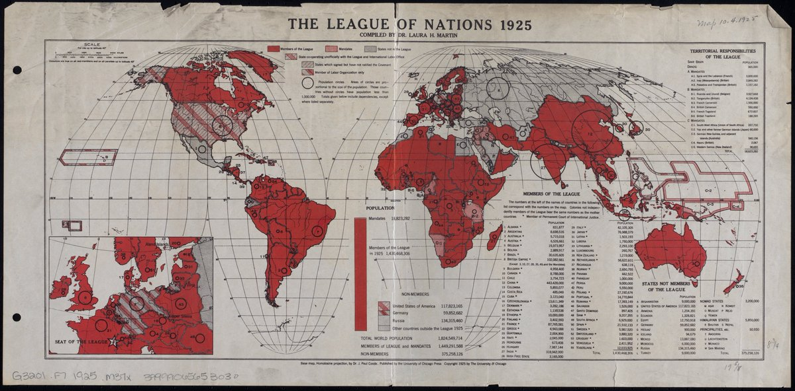
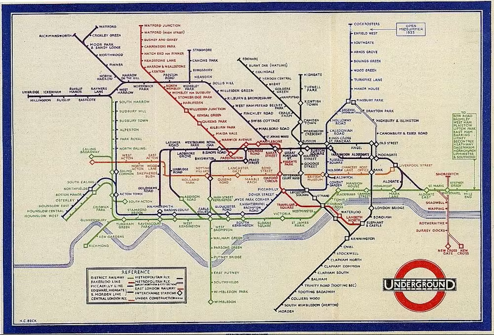
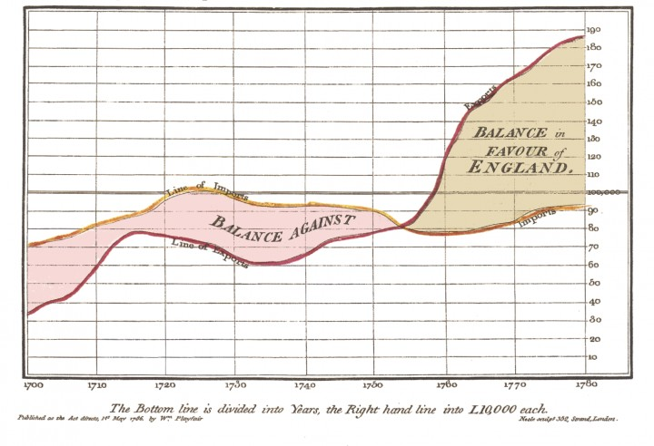
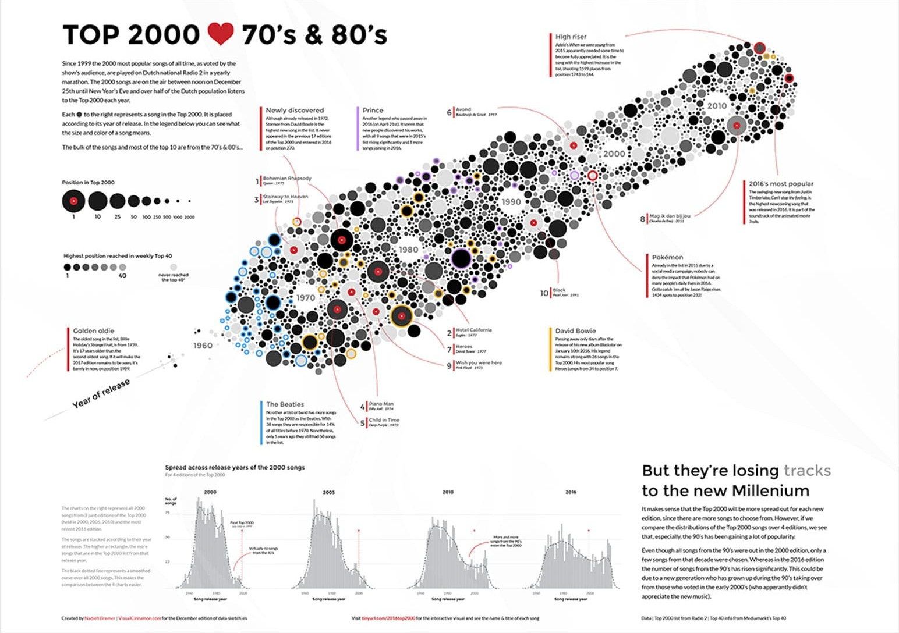
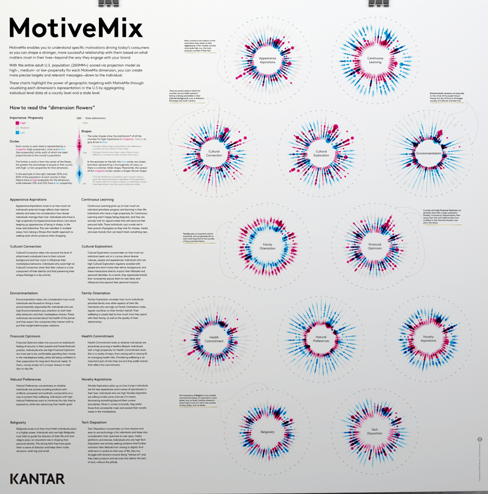
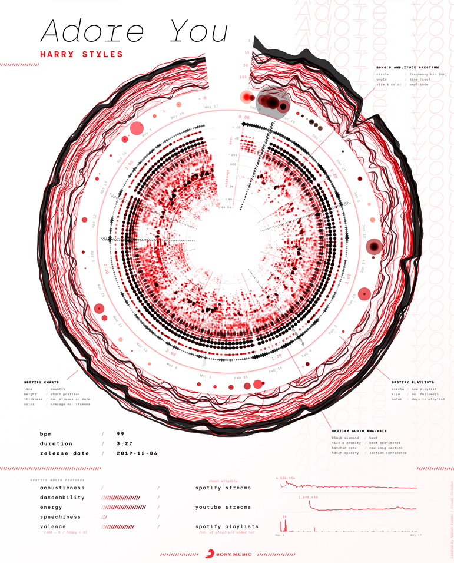

<!--
module_id: unidad-formativa-01
author: Equipo gestor de la plataforma datos.gob.es
email: contacto@datos.gob.es
date: 09/06/2026
version: 0.1.0.0
language: es
narrator: Spanish Female
mode: Textbook
title: Unidad 02 - Visualización de datos
comment: Esta unidad presenta los conceptos básicos, historia y tipos de visualización de datos. 
long_description: Unidades didácticas. Unidad 07 - Visualización de datos. Más información en [datos.gob.es](https://datos.gob.es/)

edit: true

repository: https://github.com/datosgobes/unidad-formativa-02

logo:     https://cdn.jsdelivr.net/gh/datosgobes/unidad-formativa-00@main/assets/img/logo_dge_square.svg

icon:     https://cdn.jsdelivr.net/gh/datosgobes/unidad-formativa-00@main/assets/img/logo_conjunto.png

dark:   false

link: https://fonts.googleapis.com/css2?family=Montserrat:ital,wght@0,100..900;1,100..900&display=swap
      https://raw.githack.com/datosgobes/unidad-formativa-00/refs/heads/main/assets/css/dge-styles.css

font: Montserrat

attribute: Iniciativa de datos abiertos del Gobierno de España [CC BY 4.0](https://creativecommons.org/licenses/by/4.0/)
-->

# Unidad 02 - Visualización de datos

Esta unidad didáctica ofrece una visión general de la **visualización de datos contemporánea**, una **breve historia** de la visualización y los **tipos de visualización** más utilizados y útiles hoy en día. 

Para consolidar lo aprendido, contarás con **ejercicios** en cada bloque, un **cuestionario final** y un **resumen** que recogerá las ideas más importantes.

Para comenzar, te invitamos a ver un breve **vídeo introductorio** que ofrece una visión general de los conceptos fundamentales que exploraremos a lo largo de los distintos apartados. Este recurso audiovisual te permitirá situarte en el tema, comprender su importancia y anticipar las ideas clave que desarrollaremos con mayor profundidad.

**¡Adelante!**

También puedes ver la [versión en inglés](https://www.youtube.com/watch?v=S1Rvfu5mqfc)<!-- style="target: _blank" --> del vídeo

---

## Información inicial

{{|>}}
*************************************************************************************************************

  
  

    
📌

Título: <b>Visualización de datos </b>. 

  

  

    
📋

Descripción: 
		La unidad describe <b>todos los elementos</b> que hay que abordar a la hora de realizar una <b>visualización de datos</b>, desde el procesamiento de los datos de entrada para disponer del formato adecuado hasta la capa de presentación para poder acceder a la visualización en un entorno web; incluye también una revisión de los <b>tipos más frecuentes de visualización contemporánea</b> que podemos utilizar. En cada paso <b>se recomiendan una serie de herramientas</b>, gratuitas y de acceso libre, a las que podemos recurrir para realizar las visualizaciones.

  

  

    
👥

Público objetivo: 
		Esta unidad didáctica está orientada a toda aquella persona que desee <b>iniciarse en el mundo de la visualización contemporánea</b> y que tenga interés en aprender todo el <b>espectro de posibilidades</b> que ofrecen las herramientas actuales. Esto incluye a aquellos interesados tanto en difundir datos de impacto social como a aquellos en <b>entornos profesionales que utilicen datos abiertos</b>. Las categorías profesionales que pueden beneficiarse de los contenidos de este curso son: analistas de datos, periodistas de datos, desarrolladores, programadores, diseñadores gráficos e ilustradores, entre otros. 

  

  

    
🎓

Conocimientos previos:
		Esta unidad didáctica arranca desde los principios básicos de la visualización por lo cual puede ser seguida adecuadamente por cualquier usuario. No obstante, para el tratamiento de datos inicial, <b>el manejo de un lenguaje de programación como R o Python es recomendable</b>. Para la creación de proyectos de visualización se ofrecen toda una serie de herramientas desde muy básicas a más complejas. Asimismo, la <b>familiaridad con lenguajes como JavaScript puede ayudar para el desarrollo de visualizaciones y frontales web</b> que alberguen esas visualizaciones.

  

  

    

      

🎯

Objetivos

      
      

	  
	  Los objetivos didácticos que cubre esta unidad didáctica son: 
- Introducir **históricamente** el ámbito de la visualización de datos, explicando los motivos por los cuales empleamos visualizaciones y qué es la visualización contemporánea. 
- Proporcionar **herramientas básicas** al analista de datos, periodista, desarrollador, programador, diseñador gráfico o ilustrador que desee iniciarse en el mundo de la visualización de datos contemporánea. 
- Explicar los **formatos de datos** más populares que se utilizan en la actualidad para visualizar datos en entornos web, así como su adecuación según la tecnología que empleada y del tipo de visualización. 
- Introducir las **cuatro grandes familias de visualización contemporánea**: representación de magnitudes, series temporales,  elementos interconectados y mapas y cartografía
      

    

    

      

📑

Contenidos

      
      

1. Introducción
   - Breve historia de la visualización de datos
   - Impacto social y empresarial de la visualización
   - Tareas del desarrollador de visualizaciones de datos
2. Tipos y herramientas
2.1 Formatos de datos para visualización
   - CSV, TSV, TXT
   - JSON
2.2 Tipos de visualizaciones
   - Magnitudes
   - Series Temporales
   - Redes y Jerarquías
   - Cartografía y Mapas
3. Frontales web
3.1 HTML y CSS
3.2 Javascript
3.3 Observable
      

    

  

  
  

	

		⚠️ Aviso
	

	

El desembarco de nuevas tecnologías a lo largo de las últimas décadas no ha desbancado totalmente la <b>creación de piezas de visualización artesanas</b>, hechas fuera del mundo digital. Estas emplean todo tipo de materiales y técnicas que también se benefician de otros avances tecnológicos, y permiten llegar al público de forma <b>muy efectiva e impactante</b>.
	

	

		💡 Ejemplo
	

	

El proyecto <a href="https://showyourstripes.info/showcase" target="_blank" rel="noopener">ShowYourStripes</a> aborda el <b>incremento de la temperatura en la superficie de la Tierra</b> a través del color, pasando de tonos fríos si la temperatura es inferior a una media temporal histórica, a cálidos, si la temperatura es mayor que esa media histórica, a lo largo del tiempo. En todos los puntos se puede observar cómo la tendencia es pasar de tonos fríos a cálidos, dejando patente el calentamiento global que está experimentando el planeta. Este proyecto cuenta con <b>representación en todo tipo de soportes</b> más allá de los digitales, en concreto sobre patrones textiles o cerámicos. 
	

  

    
🔍

Guía de uso: en la <a href="https://liascript.github.io/course/?https://raw.githubusercontent.com/datosgobes/unidad-formativa-00/main/CURSO.md#1" target="_blank" rel="noopener">Unidad 00</a> encontrarás información sobre las funcionalidades de las unidades, la estructura global, como reutilizar los materiales, etc.

  

  

    
🏷️

Versión de la unidad: v1.0.0

  

  

    Empieza el curso o descarga la documentación
    

      <a href="https://github.com/datosgobes/unidad-formativa-01/releases/download/latest/documentation-unidad-formativa-01.pdf" target="_blank" rel="noopener" class="botones_doc">📄 PDF</a>
      <a href="https://github.com/datosgobes/unidad-formativa-01/releases/download/latest/scorm-unidad-formativa-01.zip" target="_blank" rel="noopener" class="botones_doc">📦 SCORM</a>
      <a href="https://github.com/datosgobes/unidad-formativa-01/releases/download/latest/ims-unidad-formativa-01.zip" target="_blank" rel="noopener" class="botones_doc">📚 IMS</a>
    

  

*************************************************************************************************************

<!-- id="historia_0" -->
## Introducción

En esta sección contextualizaremos la existencia de la visualización de datos en el desempeño del análisis e interpretación de los datos, desde el origen histórico hasta el uso contemporáneao. Asimismo, se aborda su creciente transversalidad en cuanto a aplicaciones y las habilidades necesarias para poder ejercer esta profesion. 

El **breve recorrido por la historia** de la visualización de datos, desde las primeras formas de representar mapas y cartografías hasta los recientes avances tecnológicos, se divide en dos períodos:

- **La astronomía y el origen de la visualización**
- **La revolución del siglo XIX en la visualización contemporánea**

La difusión contemporánea de la visualización nos permite destacar los aspectos más relevantes que han permitido su **integración tanto en el mundo de la prensa como en el mundo empresarial**. 

Finalmente se especifican **todas las áreas profesionales** que cubren el proceso de desarrollo de un proyecto de visualización, desde su concepción gráfica hasta su implementación en un entorno web, entre los que se encuentran:

- **Análisis de datos**
- **Geometría**
- **Diseño gráfico**
- **Periodismo**
- **Desarrollo web**

De este modo adquirimos ese contexto, tanto histórico como social, a la hora de desarrollar proyectos de visualización de datos. 

### La astronomía y el origen de la visualización 

{{|>}}
*************************************************************************************************************

La visualización existe probablemente desde **antes incluso del desarrollo de la escritura** y de los primeros sistemas alfabéticos por la humanidad. La representación de las estrellas en el firmamento, y, posteriormente, el desarrollo de cartografías en el plano terrestre fueron probablemente las **primeras trazas de visualización** que desarrolló el ser humano. 

	

		💡 Ejemplo
	

	

En la Figura 1 se puede observar la <b>distribución de estrellas de la constelación de Pegaso</b> realizada por Johann Bayer en 1603, un ejemplo que recoge la práctica milenaria de referenciarnos dentro del espacio y del universo. 

	

La observación astronómica trae consigo, de hecho, uno de los **mayores giros conceptuales** en la percepción que ha hecho el ser humano del conocimiento.

	

		💡 Ejemplo
	

	

En 1694 Galileo Galilei publica su obra sobre la <b>posición de las estrellas no visibles a simple vista</b> gracias al uso del telescopio, al comienzo del desarrollo y uso de tales artilugios (Figura 2). 

	

La información que se escondía en la bóveda celeste -y que se revela a través del telescopio- da pistas sobre un orden y una profundidad de conocimiento que, por entonces, solo era explorada de forma abstracta por creencias y religiones. Galileo enuncia el concepto de **Oculata Certitudine**, es decir, el hecho de que la verdad está en la observación de lo que vemos, una idea que anidó entonces en la sociedad occidental hasta nuestros días, y que se considera precursora del método científico y del desarrollo tecnológico. De esta forma, **la verdad queda vinculada explícitamente al sentido visual**. 

 📖[ Fuente](https://www.edwardtufte.com/book/beautiful-evidence/)

*************************************************************************************************************

<!-- id="historia_2" -->

### La revolución del siglo XIX en la visualización contemporánea

{{|>}}
*************************************************************************************************************

Con el avance científico, matemático y estadístico en los siglos posteriores se llega a creación de las **primeras tablas en formato impreso**, ricas en contenido, pero **difíciles de interpretar** a simple vista. Es en ese momento cuando surge la visualización moderna, utilizando los ejes cartesianos X e Y para la representación de información. No será hasta la **segunda mitad del siglo XIX** cuando la visualización contemporánea, tal y como la conocemos, comienza a consolidarse. 

	

		💡 Ejemplo
	

	

Florence Nightingale, enfermera inglesa destinada en la guerra de Crimea, desarrolló todo un conjunto de nuevas visualizaciones gracias a su análisis estadístico sobre la <b>mortandad en las unidades hospitalarias</b> en las que estuvo destinada (Figura 3). A pesar de la familiaridad actual con este tipo de diagramas, en su momento fue una <b>aproximación rupturista</b> a la representación de magnitudes. 

	

	

		💡 Ejemplo
	

	

Charles Minard describió la sangrienta campaña en el frente ruso de las tropas napoleónicas, con todo un grueso de tropas menguante que viaja de oeste a este y que posteriormente emprende su camino de retarguardia, ya en un número muy diezmado (Figura 4). Más allá de su propuesta visual, en trabajo de Charles Minard <b>se caracteriza por mencionar sus fuentes y citarlas apropiadamente</b>, estableciendo nuevos códigos de rigor y método. 

	

	

		💡 Ejemplo
	

	

W.E.B. duBois refleja sus estadísticas de la realidad socioeconómica de la población afroamericana tras la ilegalización de la esclavitud en toda una serie de visualizaciones que presenta en la exposición universal de París de 1900. Destaca en su <b>uso del color así como en el uso de nuevas formas geométricas</b> hasta entonces inéditas (Figura 5). 

	

Todos ellos pusieron la visualización a otro nivel, tanto en lo relativo al **rigor numérico y citación de fuentes** como en la adopción de una **aproximación gráfica y estética absolutamente rupturista** con el clasicismo de los ejes cartesianos de los siglos anteriores.

De esta forma se llega al siglo XX, donde las **grandes tiradas de prensa popularizan definitivamente el uso de la visualización de datos** y ésta pasa a formar parte de muchas de las narrativas periodísticas. El siglo XXI trae consigo la irrupción de Internet y el aumento de la capacidad de cálculo de los circuitos integrados basados en materiales semiconductores, ofreciendo potentes herramientas tanto de análisis como de visualización desplegando un universo de posibilidades impensables hace unas décadas, tanto de volumen de datos como de creatividad. 

  

	

		⚠️ Aviso
	

	

		
La revolución digital ha traído consigo, no solo el **desarrollo de potentes herramientas de cálculo y diseño**, sino también dispositivos electrónicos que basan su interacción con el ser humano, en gran medida, en lo visual a través de pantallas táctiles. Este fenómeno ha **predispuesto a los usuarios a consumir información visual** por encima de cualquier otro tipo de formatos, favoreciendo el uso de visualizaciones frente a la lectura atenta de texto. La visualización de datos se ve así impulsada por estos dispositivos y encuentra su lugar en la actualidad gracias a contar con **un público habituado a consumir información visual**. 
	

 📖[ Fuente](https://www.edwardtufte.com/book/beautiful-evidence/)

 

	

		ℹ️ Más información
	

	

- <a href="https://www.edwardtufte.com/book/the-visual-display-of-quantitative-information/?_gl=1*uzj41e*_up*MQ..*_ga*NDI3Njk5Mjc4LjE3ODI5MTczNDg.*_ga_JCT37YWSC9*czE3ODI5MTczNDYkbzEkZzEkdDE3ODI5MTczODIkajI0JGwwJGgw">The Visual Display of Quantitative Information, de Edward R. Tufte</a>
  

*************************************************************************************************************

<!-- id="ejercicio_0" -->

### Ejercicio 1

Sitúa en el tiempo las siguientes visualizaciones, identificando si el periodo de creación es anterior a 1850, si pertenece al periodo 1850-2000, o si por el contrario fue creada en este siglo.  

{{|>}}
*************************************************************************************************************

- [(X)] < 1850
- [( )] 1850 - 2000
- [( )] > 2000

- 

- [( )] < 1850
- [(X)] 1850 - 2000
- [( )] > 2000

- 

- [( )] < 1850
- [(X)] 1850 - 2000
- [( )] > 2000

- 

- [( )] < 1850
- [( )] 1850 - 2000
- [(X)] > 2000

- 

- [( )] < 1850
- [(X)] 1850 - 2000
- [( )] > 2000

- 

- [(X)] < 1850
- [( )] 1850 - 2000
- [( )] > 2000

- 

- [( )] < 1850
- [( )] 1850 - 2000
- [(X)] > 2000

- 

- [( )] < 1850
- [( )] 1850 - 2000
- [(X)] > 2000

*************************************************************************************************************

<!-- id="conceptos-clave" -->
### Impacto social y empresarial de la visualización 

{{|>}}
*************************************************************************************************************

Como hemos visto, el ámbito en el cual se han desarrollado proyectos de visualización ha pasado de ser un nicho ligado a contextos primitivos de localización astronómica a una **omnipresencia tanto en Internet como en la prensa escrita**. 

Tradicionalmente, **el ámbito periodístico y social ha sido el motor** para el desarrollo de esta disciplina, interesada en transmitir de forma rápida e intuitiva información relevante que debe ser comprendida en poco tiempo por lectores no necesariamente dispuestos a leer artículos de texto. 

De todos esos avances se ha beneficiado el mundo empresarial, una vez que **la cantidad de datos a manejar ha crecido exponencialmente** y la representación de la realidad corporativa ya no se podía realizarse de forma estrictamente oral o convencional a través de informes únicamente de texto. El propio interés empresarial ha permitido **el desarrollo de herramientas muy potentes para visualización**, tanto a nivel cartográfico (Google Earth, KeplerGL) como en formas más básicas de representación. 

	

		💡 Ejemplo
	

	

Kpler, empresa que monitoriza el movimiento de materias primas y derivados de combustibles fósiles a través del transporte marítimo por todo el planeta, se ha erigido como una **referencia a la hora de representar grandes cantidades de datos visualmente** de forma innovadora, individualizando **trayectorias de cargueros** en alta mar, así como representando **cantidades derivadas de volúmenes transportados**. 
	

*************************************************************************************************************

### Tareas del desarrollador de visualizaciones de datos 

{{|>}}
*************************************************************************************************************

El trabajo de visualización de datos **implica el conocimiento de muchas disciplinas**, sin que haya una jerarquía establecida o preferente para cada una de ellas. Al final, lo que cuenta es la audiencia para la cual se realiza ese trabajo de visualización. Y esa audiencia es la que decide qué peso relativo tienen el análisis, las formas, la interactividad y la forma de publicitar la visualización y sobre qué soporte. 

Trabajar en visualización de datos implica: 

- **Análisis de datos**: con mucha frecuencia, y casi en la totalidad de casos, la visualización nunca es un camino de una sola dirección. Disponer de la información de forma gráfica siempre despierta nuevas cuestiones y preguntas a resolver que requieren volver al análisis de datos para refinar, acotar, o recalcular métricas de interés. El visualizador de datos no sólo debe saber "dibujar", sino también **comprender numérica y estadísticamente cuál es el mensaje** que se desea transmitir. 

- **Geometría**: la elección de las formas más adecuadas para la descripción de datos de forma gráfica es fundamental. Estas formas suelen seguir patrones geométricos que **es importante conocer desde un punto de vista matemático** para conocer sus posibilidades. La visualización debe poder soportar todo el espectro de datos que manejamos, por lo que resulta importante adaptar la geometría a los mínimos y máximos numéricos dentro del espectro de datos.

- **Diseño gráfico**: la estética, tanto de formas como de colores, es una moda y está estrechamente ligada al momento cultural en el que se vive. El **conocimiento de determinados códigos visuales**, así como la interpretación de cada sociedad sobre el significado de los colores juegan un papel muy importante en el diseño de visualizaciones de datos.

- **Periodismo**: todo proyecto de visualización de datos se enmarca dentro de una narrativa. Esta narrativa obedece a criterios periodísticos a la hora de maquetar y redactar todo lo referente a la visualización. **La historia debe fluir y debe ser igualmente rigurosa** a la hora crear todos los contenidos alrededor del elemento gráfico.

- **Desarrollo Web**: vivimos en un momento en el cual el consumo de información se realiza de forma digital, de forma que es necesario el manejo de determinadas tecnologías que nos permitan **crear y difundir esas piezas gráficas en los formatos digitales** conocidos actualmente. Hoy en día hay entornos web que permiten no solo mostrar visualizaciones sino también incluir interactividad, animación y toda una serie de efectos y transiciones para crear una narrativa, o storytelling. 

*************************************************************************************************************

<!-- id="tipos_0" -->
## Tipos y Herramientas

En esta sección abordaremos la definición de **los elementos necesarios** para la realización de proyectos de visualización, desde el formato de los datos hasta las herramientas de acceso libre y gratuito para su realización. 

En la primera parte se explican las **definiciones y estructura de los formatos de datos** más populares y de uso más frecuente dentro del desarrollo de proyectos de visualización. En concreto estos formatos son: 

- **CSV, TSV y TXT**
- **JSON**
- **GoogleSheets**

Dentro de los tipos de visualizaciones, se detallan los elementos que constituyen **las cuatro grandes familias de visualización contemporánea** y dentro de las cuales se agrupan la mayoría de las visualizaciones que podemos desarrollar. Igualmente, las **visualizaciones que vemos día a día** tanto en los entornos de prensa como corporativos pueden asociarse a alguna de estas familias, ofreciendo **diferentes posibilidades para representar los datos** de forma diferente. Estas familias son: 

- **Magnitudes**
- **Series temporales**
- **Nodos y jerarquías**
- **Mapas y cartografía**

### Formatos de datos para visualización

{{|>}}
*************************************************************************************************************

Los datos abiertos suelen presentarse en un **amplio espectro de formatos**, dependiendo del organismo que los publica y de los medios por los cuales los ha obtenido. A pesar de esta diversidad, el mundo de la visualización de datos suele ceñirse a un subconjunto de formatos. En concreto, se centra en aquellos que aseguran **facilidad de lectura dentro de unos estándares** y, sobre todo, para el **acceso  de forma estructurada**, para así poder repetir patrones para cada entrada en el fichero de los datos. 

En esta sección y en las siguientes incorporamos herramientas para poder abordar y trabajar sobre los conceptos que se explican. Las herramientas proporcionadas son de acceso gratuito y permiten familiarizarnos con los formatos planteados. 

  

	

		⚠️ Aviso
	

	

El conjunto de formatos presentado aquí representa la mayor parte de <b>datos con un número pequeño o moderado de entradas</b>. La explosión del big data ha traído consigo la creación de nuevos formatos tales como bases de datos o como el formato .parquet, por ejemplo, que pueden contener millones de entradas y por lo tanto son formatos difíciles de manejar por herramientas tradicionales de análisis y visualización, y que necesitan de software específico. 
	

		CSV, TSV, TXT

Estas siglas esconden un acrónimo en inglés equivalente respectivamente a **Comma Separated Value** (CSV), **Tab Separated Value** (TSV) o **Text** (TXT), que puede adoptar la forma tanto del CSV como del TSV. En estos casos los datos se disponen en hileras cuyas columnas están separadas bien por comas (CSV), bien por tabulaciones (TSV) dentro de cada fila. Al tener siempre el mismo carácter diferenciador, bien sea la coma o la tabulación, es muy fácil para lenguajes como Python o R interpretar el contenido del fichero de entrada y estructurarlo acorde con esos separadores.

	

		💡 Ejemplo
	

	

		En la Figura 6 se muestra el contenido de un fichero CSV con información correspondiente a <b>aeropuertos a escala global</b>. En él se detallan las categorías en la primera fila, como por ejemplo su latitud, longitud, altitud, código IATA o la región y el país en el que se encuentran. En el resto de filas se ofrece la información con una fila para cada aeropuerto. 
		

	

		JSON

Estas siglas significan **JavaScript Object Notation**, y hacen referencia a una estructura de datos donde los valores y magnitudes vienen **en forma de pares**, donde a una categoría se asocia un valor. Estas estructuras pueden agruparse en cadenas o arrays de elementos. Su desarrollo estuvo motivado por el intercambio de información necesario para nutrir las páginas web y los navegadores, y ha acabado por convertirse en un estándar válido también fuera de estos ámbitos. 

	

		💡 Ejemplo
	

	

		En la Figura 7 se observa la estructura de un fichero JSON. A diferencia de un CSV en este caso la información <b>está ordenada por pares</b>, de forma que una categoría tiene asociada un valor concreto. Estos pares <b>se pueden anidar</b> dentro de una estructura parent-children, lo que permite también crear jerarquías si la propia estructura de los datos lo necesitan. 
	

	

  

    Herramientas para cambios de formato
  

  

    

     

        
Python

			Python es uno de los lenguajes más utilizados en análisis de datos. Permite la lectura de un amplio rango de ficheros de datos, así como su procesamiento, análisis y conversión de formato para todo tipo de aplicaciones. 
      

		

        
R

			Lenguaje de programación libre muy utilizado en estadística y análisis de datos. Dispone de un amplio ecosistema de paquetes que permiten trabajar con datos públicos de forma reproducible y transparente.
      

		

        
Excel

			Tradicional herramienta de estructuración de datos, cálculos sencillos y visualización a través de elementos clásicos. 
      

		

        
Google Sheets

			Es una aplicación de hoja de cálculo basada en la web que permite organizar, analizar y compartir datos de manera eficiente, facilitando la colaboración en tiempo real entre múltiples usuarios.
      

    

  

*************************************************************************************************************

<!-- id="vis_0" -->

### Tipos de Visualizaciones

{{|>}}
*************************************************************************************************************

En esta sección veremos los **tipos de visualizaciones más populares**, ya consolidadas dentro de los discursos y narrativas tanto de la prensa como de las aplicaciones y empresas que desarrollan proyectos de análisis y productos que necesitan de la representación gráfica de grandes cantidades de datos. 

Las visualizaciones se suelen distribuir en cuatro grandes familias: 
- **Magnitudes**
- **Series temporales** 
- **Redes, nodos y jerarquías** 
- **Mapas y cartografía**

 📖[ Fuente](https://www.albertocairo.com/)

	

		ℹ️ Más información
	

	

- <a href="https://www.stefanieposavec.com/books">Literatura diversa sobre visualización, de Stefanie Posavec</a>
- <a href="https://www.visualcinnamon.com/chart/">Chart, de Nadieh Bremer</a>
- <a href="https://flowingdata.com/books/">Literatura diversa sobre visualización, de Nathan Yau</a>
- <a href="https://www.analyticspress.com/smtn.php">Show Me The Numbers, de Stephen Few</a>
  

 
*************************************************************************************************************

<!-- id="vis_1" -->

#### Magnitudes

{{|>}}
*************************************************************************************************************

Las magnitudes hacen referencia a **conjuntos de valores discretos e independientes**, que no están vinculados por una dimensión temporal ni están jerarquizados. Suelen ser datos que se presentan asociados a un número determinado de categorías. La intensidad, tamaño o peso se representa mediante proporciones geométricas.

		Burbujas

Tiene su origen en el scatter plot, **círculos posicionados en un plano cartesiano**. La independencia de esos ejes, gracias a herramientas modernas para calcular posiciones relativas, ha hecho de los diagramas de burbujas una propuesta muy atractiva, ya que permite añadir dimensiones de información, no sólo al radio, sino también al color o a la transparencia. 

	

		💡 Ejemplo
	

	

			
")

	

		Treemap

Muy popular para datos económicos. El treemap **distribuye un espacio limitado en parcelas** cuyo tamaño es proporcional a la magnitud en estudio. De esta forma es directamente comparable el valor de diferentes categorías y es posible explorar el color como otro eje de información adicional. 

	

		💡 Ejemplo
	

	

	
")

	

		Voronoi

Semejante al treemap, pero utilizando a la inversa el cálculo de Voronoi de los **puntos equidistantes a los límites de un espacio definido por celdas**, o polígonos de Thiessen. De esta forma se distribuye el espacio en celdas cuya superficie es proporcional al valor de cada categoría.  

	

		💡 Ejemplo
	

	

	
")

	

		Paths

Gráfico utilizado para representar **trayectorias uniendo puntos mediante líneas** que reflejan el movimiento o la evolución de un fenómeno, ya sea en el espacio o en el tiempo.  Permiten un diseño más creativo a la hora de crear representaciones gráficas, siempre que se guarde un principio de proporcionalidad, bien en la forma o en la gradación de color. 

	

		💡 Ejemplo
	

	

			
")

	

		Araña

Gráfico que representa múltiples variables mediante **ejes que se extienden desde un centro común**, formando una figura poligonal que permite visualizar y comparar perfiles o distribuciones de datos de manera global. El polígono resultante de la unión de todos los puntos por eje crea el llamado diagrama de araña, y en determinadas ocasiones se puede otorgar algún significado al volumen resultante del polígono. 

	

		💡 Ejemplo
	

	

					
")

	

  

    Herramientas para visualizar magnitudes
  

  

    

      

        
D3.js

		  Es uno de los referentes en visualización web. Se basa en estándares abiertos y permite un control total sobre la representación visual de los datos. Su flexibilidad es muy alta, aunque también lo es su complejidad.
      

      

        
Tableau

		  Plataforma de análisis de datos que permite la conexión a bases de datos y creación de cuadros de mando con un alto grado de customización.
      

		

        
PowerBI

			Plataforma de Microsoft de análisis de datos que crea cuadros de mando sobre unidades semánticas conectando bases de datos con un frontal de visualización.
      

		

        
Datawrapper

			Muy utilizada en comunicación pública y periodismo de datos. Permite crear gráficos claros, mapas y tablas interactivas sin necesidad de conocimientos técnicos. Es especialmente adecuada para explicar datos de forma comprensible a un público amplio.
      

		

        
RAWGraphs

			Herramienta de software libre orientada a la exploración visual. Permite experimentar con tipos de gráficos menos habituales y descubrir nuevas formas de representar datos. Resulta especialmente útil en fases exploratorias.
      

		

        
Canva

			Aunque su enfoque es más divulgativo que analítico, puede ser útil para crear piezas visuales sencillas que integren gráficos básicos con elementos de diseño. Es adecuada para la comunicación visual de resultados, no tanto para el análisis de datos.
      

    

  

*************************************************************************************************************

<!-- id="vis_2" -->

#### Series temporales

{{|>}}
*************************************************************************************************************
Una serie temporal es una **representación cronológica de eventos** para que se entienda qué pasó y cuándo de una serie de hitos. Es una de las más antiguas representaciones de información de forma visual para las series temporales son los **ejes cartesianos y sus variantes**. Esta representación se apoya en la interpretación que hace la cultura occidental sobre la **linealidad del tiempo**, en comparación con la circularidad o recursividad de la dimensión temporal en las culturas orientales. De esta forma, existen diversas formas de representar el tiempo que enumeramos aquí.  

		Ejes cartesianos

Los ejes cartesianos, x e y, permiten asociar la **dimensión temporal al eje X**, mientras que la magnitud asociada a cada intervalo temporal se representa en el eje Y. A partir de ahí, se pueden dibujar puntos, líneas o áreas, si el volumen integrado bajo la línea tiene algún tipo de información relevante. 

	

		💡 Ejemplo
	

	

	
")

	

		Ejes verticales

El **scroll vertical de los dispositivos digitales** ha permitido la creación de diagramas para las series temporales aprovechando esta circunstancia, y por lo tanto habilitando una gran longitud para el eje temporal. Asociando el eje temporal al eje Y en dirección vertical, se pueden desarrollar narrativas largas y continuas, plenamente adaptadas a la forma de navegación de los contenidos digitales.

	

		💡 Ejemplo
	

	

			
")

	

		Ejes radiales

Siguiendo la tradición más oriental y redundando en la recursividad del tiempo, es posible **dibujar el eje temporal en forma de círculo**. De este modo, el calendario adopta una forma igualmente lógica y muy atractiva para describir eventos asociados al calendario.  

	

		💡 Ejemplo
	

	

					
")

	

		Sankey

La **transmisión de flujos** de unos nodos a otros adopta su mejor expresión en los llamados diagramas de Sankey. Un diagrama de Sankey es una representación gráfica en la que los flujos entre distintos nodos se muestran mediante líneas cuya anchura es proporcional a la magnitud del flujo, permitiendo visualizar cómo se distribuye una cantidad desde un origen hacia uno o varios destinos. Se utiliza mucho para flujos de energía, recursos o presupuestos (de dónde vienen y a dónde van los fondos). 

	

		💡 Ejemplo
	

	

	
")

	

  

    Herramientas para visualizar series temporales
  

  

    

      

        
D3.js

		  Es uno de los referentes en visualización web. Se basa en estándares abiertos y permite un control total sobre la representación visual de los datos. Su flexibilidad es muy alta, aunque también lo es su complejidad.
      

      

        
Tableau

		  Plataforma de análisis de datos que permite la conexión a bases de datos y creación de cuadros de mando con un alto grado de customización.
      

		

        
PowerBI

			Plataforma de Microsoft de análisis de datos que crea cuadros de mando sobre unidades semánticas conectando bases de datos con un frontal de visualización.
      

		

        
Datawrapper

			Muy utilizada en comunicación pública y periodismo de datos. Permite crear gráficos claros, mapas y tablas interactivas sin necesidad de conocimientos técnicos. Es especialmente adecuada para explicar datos de forma comprensible a un público amplio.
      

		

        
Python

			Python es uno de los lenguajes más utilizados en análisis de datos. Matplotlib permite crear gráficos estáticos personalizables, mientras que Plotly facilita la creación de visualizaciones interactivas. Juntas ofrecen un buen equilibrio entre potencia y flexibilidad.
      

		

        
R

			Lenguaje de programación libre muy utilizado en estadística y análisis de datos. Dispone de un amplio ecosistema de paquetes que permiten trabajar con datos públicos de forma reproducible y transparente.
      

		

        
Excel

			Tradicional herramienta de estructuración de datos, cálculos sencillos y visualización a través de elementos clásicos. 
      

		

        
ApacheSuperset

			 Es una plataforma de inteligencia empresarial de código abierto diseñada para la exploración y visualización de datos, que permite a los usuarios crear dashboards interactivos y realizar consultas ad hoc sin necesidad de programación.
      

		

        
Grafana

			Es una aplicación web de análisis y visualización de datos de código abierto que permite a los usuarios crear paneles de control personalizables para mostrar métricas, registros y trazas a partir de diversas fuentes de datos. Se utiliza comúnmente para monitorear aplicaciones y recursos de hardware.
      

		

        
RAWGraphs

			herramienta de software libre orientada a la exploración visual. Permite experimentar con tipos de gráficos menos habituales y descubrir nuevas formas de representar datos. Resulta especialmente útil en fases exploratorias.
      

    

  

*************************************************************************************************************

<!-- id="vis_1" -->

#### Redes y Jerarquías

{{|>}}
*************************************************************************************************************

Con el desarrollo de **sistemas complejos interconectados** y de las interdependencias entre esos nodos, se ha desarrollado todo un campo de la visualización como es el de redes y jerarquías. Este ámbito se ocupa de representar elementos interconectados que aportan además información de las relaciones entre esos elementos.   

**Nodos**

La más básica de esas representaciones es una **estructura en árbol** en la cual las ramas se despliegan a medida que crece el número de nodos. Este diagrama acepta tanto las orientaciones tanto horizontal como vertical 

	

		💡 Ejemplo
	

	

			
")

	

**Nodos Radiales**

Aprovechando el desarrollo de nuevas propuestas gráficas y la capacidad del lenguaje para dar forma, nace el diagrama de nodos radiales. Este tipo de gráfico adopta una **orientación radial de dentro hacia afuera**, resultando especialmente eficaz cuando el número de elementos es muy alto, ya que permite que y los subconjuntos o subcategorías se desplieguen en más y más ramas radiales. 

	

		💡 Ejemplo
	

	

				
")

	

  

    Herramientas para visualizar nodos
  

  

    

      

        
D3.js

		  Es uno de los referentes en visualización web. Se basa en estándares abiertos y permite un control total sobre la representación visual de los datos. Su flexibilidad es muy alta, aunque también lo es su complejidad.
      

      

        
Tableau

		  Plataforma de análisis de datos que permite la conexión a bases de datos y creación de cuadros de mando con un alto grado de customización.
      

		

        
PowerBI

			Plataforma de Microsoft de análisis de datos que crea cuadros de mando sobre unidades semánticas conectando bases de datos con un frontal de visualización.
      

		

        
Cosmograph

			Herramienta para la visualización de un gran número de interconexiones y elementos asociados de forma jerárquica. 
      

    

  

*************************************************************************************************************

<!-- id="vis_3" -->

#### Cartografía y Mapas

{{|>}}
*************************************************************************************************************

El mundo de los mapas y la cartografía es un universo en sí mismo, con **siglos de antigüedad y en constante evolución**. A pesar de ser un sistema de representación emparentado con los ejes cartesianos y por lo tanto con un peso tradicional del que le cuesta desprenderse, hoy en día combina lo mejor de los dos mundos, tanto el aspecto más tradicional como propuestas más arriesgadas que invitan a repensar cómo vemos el mundo más allá de esa tradición.  

Las formas de representación geográfica son numerosas; se citan algunas de ellas en esta sección.  

**Puntos**

Dentro de la tradición, representar localizaciones o eventos **a través de la latitud y la longitud** sigue siendo un clásico que funciona en todos los ámbitos. 

	

		💡 Ejemplo
	

	

	
")

 	

**Trayectorias**

Las rutas, especialmente las correspondientes al transporte aéreo o marítimo, suelen contar con **datos muy detallados sobre su posición en el tiempo**. Esto permite trazar sus trayectorias con ayuda de líneas sobre un fondo cartográfico. 

	

		💡 Ejemplo
	

	

			
")

	

**Coropletas**

La división del territorio en márgenes y límites de diversa índole, tales como países, regiones, comunidades o distritos, permite asociar valores a estas unidades y **visualizar el terreno en forma de polígonos** con colores o distintos niveles de transparencia según los datos asociados. 

	

		💡 Ejemplo
	

	

			
")

	

**Teselas (Tiles)**

Determinados productos satelitales o modelos numéricos para el estudio del sistema terrestre ofrecen **datos promediados para regiones regulares** en forma de malla que cubren toda o parte de la superficie terrestre. De acuerdo con estas mallas, es posible proyectar sobre un mapa esos polígonos regularmente distribuidos para visualizar la información que ofrecen esos satélites o modelos.  

	

		💡 Ejemplo
	

	

					
")

	

**Contornos**

La **interpolación entre valores adyacentes** en una superficie permite crear contornos, a modo de curvas de nivel, para describir a base de curvas una magnitud que cambia en el espacio. De esta forma, se pueden asociar grosores de esas curvas o colores de relleno para asociar a cada punto en el espacio un determinado valor o magnitud. 

	

		💡 Ejemplo
	

	

		
")

	

**Tres dimensiones**

El incremento de **la capacidad computacional** ha permitido el desarrollo en las últimas décadas de aplicaciones ágiles y muy efectivas para visualizar la tercera dimensión (Z) sobre cartografías existentes. 

	

		💡 Ejemplo
	

	

				
")

	

**Agrupación (Binning)**

Tradicionalmente realizado con hexágonos, la **clusterización en polígonos regulares** puede simplificar la representación de magnitudes o eventos en superficies, creando, de esta forma, patrones de mucha armonía visual y sin perder rigor de contenido.  

	

		💡 Ejemplo
	

	

						
")

	

  

    Herramientas para visualizar mapas
  

  

    

      

        
D3.js

		  Es uno de los referentes en visualización web. Se basa en estándares abiertos y permite un control total sobre la representación visual de los datos. Su flexibilidad es muy alta, aunque también lo es su complejidad.
      

      

        
GoogleEarth

		  Herramienta gratuita pero no de código abierto. Su versión web permite importar archivos KML/KMZ y es útil para contextualizar información sobre imágenes satelitales.
      

		

        
KeplerGL

			Herramienta web gratuita y de código abierto que permite arrastrar y soltar archivos en formatos como CSV, GeoJSON o Shapefile y obtener visualizaciones de forma inmediata.
      

		

        
Python - Cartopy

			Es una librería que se integra con Matplotlib y está orientada a la representación de datos científicos y climáticos. Su gran fortaleza es el manejo de proyecciones cartográficas, con soporte para decenas de sistemas de referencia.
      

		

        
OpenStreetMap

			No es exactamente una herramienta de visualización, sino la base de datos geográfica colaborativa más grande del mundo, con licencia abierta (ODbL). Su ecosistema incluye herramientas como Overpass Turbo para consultar y extraer datos, y sus teselas cartográficas son la base sobre la que se construyen muchos mapas web.
      

		

        
QGIS

			El SIG de escritorio de referencia en el mundo del código abierto. Gratuito, multiplataforma y con una comunidad muy activa, cubre prácticamente cualquier necesidad de análisis y producción cartográfica.
      

				

        
ArcGIS

			La plataforma SIG comercial más utilizada en entornos profesionales e institucionales. Ofrece capacidades avanzadas de análisis, edición y publicación de mapas, y su ecosistema en la nube facilita la colaboración y la gestión de portales de datos geográficos.
      

		

        
MapLibre

			Librería de JavaScript de código abierto que permite construir mapas web interactivos de alto rendimiento mediante teselas vectoriales.
      

		

        
R

			Lenguaje de programación libre muy utilizado en estadística y análisis de datos. Dispone de un amplio ecosistema de paquetes que permiten trabajar con datos públicos de forma reproducible y transparente.
      

    

  

*************************************************************************************************************

<!-- id="ejercicio_0" -->

### Ejercicio 2

Identifica el tipo de visualización correspondiente con cada proyecto

{{|>}}
*************************************************************************************************************

- [( )] Nodos
- [( )] Coropletas
- [(X)] Sankey

- 

- [( )] Puntos
- [( )] Ejes Cartesianos
- [(X)] Ejes Radiales

- 

- [( )] Voronoi
- [(X)] Teselas
- [( )] Contornos

- 

- [( )] Ejes Radiales
- [( )] Nodos
- [(X)] Nodos Radiales

- 

- [( )] Burbujas
- [(X)] Puntos
- [( )] Teselas

- 

- [( )] Contornos
- [(X)] 3D
- [( )] Teselas

- 

- [( )] Contornos
- [( )] Paths
- [(X)] Trayectorias

- 

- [( )] Puntos
- [(X)] Burbujas
- [( )] Teselas

*************************************************************************************************************

## Frontales Web

{{|>}}
*************************************************************************************************************

El último paso dentro de la creación de una visualización es crear un entorno en que la visualización sea accesible a la audiencia. Frecuentemente, el objetivo es alcanzar el mayor público posible y, por lo tanto, se desarrollan entornos en la web que permitan su **acceso desde cualquier punto del planeta**. 

Los entornos más básicos en la web se componen de HTML, CSS y JavaScript. Veamos en esta sección su significado y sentido dentro de la construcción de una página web, y cómo JavaScript ha dado paso a toda una serie de entornos para potenciar la modularidad y reutilización de componentes. 

*************************************************************************************************************

### HTML y CSS

{{|>}}
*************************************************************************************************************

Con HTML (HyperText Markup Language), se crean los **contenedores en los cuales se distribuyen los distintos tipos de contenidos** de una página: contenedor, texto o imagen. 

Todos estos elementos pueden estar asociados a clases, para así evitar tener que caracterizar al detalle cada elemento cada vez que lo introducimos. De este modo, se define una clase y **todos los elementos vinculados a esa clase tendrán la misma apariencia**, bien sean contenedores, tipos y tamaños de texto, o tamaños y opacidades de imágenes. Esto se realiza a través de CSS (Cascading Style Sheets). 

  

    Herramientas
  

  

    

      

        
HTML

		  El lenguaje fundamental que define la estructura y contenido de las páginas web mediante etiquetas. Este lenguaje permite organizar elementos como títulos, párrafos, imágenes y enlaces en un formato que los navegadores pueden interpretar y mostrar.
      

      

        
CSS

		  Lenguaje utilizado para estilizar y dar formato a documentos HTML, permitiendo definir cómo se deben mostrar los elementos en una página web. Separa el contenido de la presentación, facilitando la creación de diseños atractivos y consistentes.
      

    

  

*************************************************************************************************************

### Javascript

{{|>}}
*************************************************************************************************************

La creciente complejidad de las páginas web ha ido demandando **lenguajes de programación con más recursos** que el HTML, siendo JavaScript uno de los más relevantes. Este lenguaje permite desarrollar **estructuras modulares recursivas y componentes reutilizables**, lo que facilita escalar fácilmente los contenidos de una página web. 

Este lenguaje también ha sido aprovechado para crear elementos visuales que comprenden todos los descritos en la sección de Tipos de Visualización. Sobre su base se han desarrollado diversos entornos y bibliotecas como React, Angular, Vue o Svelte. 

  

	

		⚠️ Aviso
	

	

La irrupción de la inteligencia artificial (IA) ha revolucionado la creación de los entornos de desarrollo web. Lo que antes era la elaboración de código por parte de especialistas llamados FrontEnd, haciendo referencia a la parte frontal y visible de la web, ha pasado a ser parcialmente automatizable por parte de los agentes de IA, que generan código donde albergar visualizaciones. La IA por lo tanto pasa a formar parte del elenco de herramientas disponibles para el desarrollo de frontales web. 
	

  

    Herramientas
  

  

    

      

        
React

		   Biblioteca de JavaScript de código abierto utilizada para construir interfaces de usuario, especialmente en aplicaciones web y móviles. Permite crear componentes reutilizables que facilitan el desarrollo de aplicaciones interactivas.
      

      

        
Angular

		   Entorno de desarrollo web de código abierto gestionado por Google, que permite crear aplicaciones web dinámicas utilizando HTML, CSS y JavaScript. Su arquitectura se basa en componentes, lo que facilita la reutilización y el mantenimiento del código.
      

		      

        
Vue.js

			Framework de JavaScript de código abierto utilizado para construir interfaces de usuario y aplicaciones de una sola página. Se caracteriza por su arquitectura progresiva, lo que permite integrarlo de manera gradual en proyectos existentes.
      

		      

        
Svelte

			Entorno de JavaScript diseñado para desarrollar interfaces de usuario, que se compila en componentes optimizados para ejecutarse en el navegador. A diferencia de otros frameworks, Svelte no utiliza un virtual DOM, lo que permite una ejecución más rápida y eficiente.
      

    

  

*************************************************************************************************************

### Observable

{{|>}}
*************************************************************************************************************

Dada la relativa laboriosidad de crear una página web desde cero, existen entornos ya creados **aptos para el desarrollo de visualizaciones** que sólo necesitan del código en JavaScript y de los datos en formato CSV o JSON, entre otros. 

Una de estas iniciativas es Observable, donde es posible crear **visualizaciones en D3.js** sin necesidad de crear un servidor local ni de crear una página en HTML y CSS previamente. Funciona a modo de notebook, y cada modificación en el código va seguida de su correspondiente ejecución en una celda destacada del propio notebook. 

	

		💡 Ejemplo
	

	

		El propio portal de datos abiertos tiene su <b>galería de visualizaciones desarrolladas en D3.js</b> dentro de Observable. En ellas es posible ver el <b>código en JavaScript</b>, los datos que utiliza para poder realizar la visualización así como el <b>resultado gráfico</b> en la parte superior del notebook. También acepta igualmente bloques de texto tanto para contextualizar el proyecto o los datos utilizados como para cada una de las líneas de código. 
		[Datos.gob.es en Observable](https://observablehq.com/@dataviz-datos-gob-es)
	

  

    Herramientas
  

  

    

      

        
Observable

		Es una plataforma en línea donde puedes escribir, ejecutar y compartir código JavaScript en tiempo real, especialmente útil para la visualización de datos en D3.js y la creación de paneles.
      

    

  

*************************************************************************************************************

<!-- id="cuestionario-final" -->
## Cuestionario final

{{|>}}
*************************************************************************************************************

Indica cuáles de las siguientes afirmaciones sobre la visualización son verdaderas y cuáles falsas.

**1) La visualización de datos comienza en la Revolución Industrial con el desarrollo del mundo moderno**

- [( )] Verdadero
- [(X)] Falso
***
> Comienza incluso antes de la historia escrita 
***

**2) Galileo enuncia en principio llamado Oculata Certitudine**

- [(X)] Verdadero
- [(_)] Falso
***
> Sentó las bases de que la verdad está en lo que se observa visualmente 
***

**3) La visualización de datos se desarrolla principalmente en el mundo de la prensa y medios escritos**

- [( )] Verdadero
- [(X)] Falso
***
> Iniciativas corporativas de empresas privadas han dado un impulso notable al mundo de la visualización 
***

**4) La geometría es la disciplina más importante en el trabajo de la visualización de datos**

- [(_)] Verdadero
- [(X)] Falso
***
> No hay una importante, sino un conjunto necesario de disciplinas como el diseño gráfico, el análisis o el periodismo
***

**5) El TSV, o tab separated value, es un formato de datos muy utilizado**

- [(X)] Verdadero
- [( )] Falso
***
> Quizá no tenga la fama del CSV, pero su uso está muy expandido y vigente hoy en día. 
***

**6) Hay un consenso sobre la interpretación del tiempo como algo lineal.**

- [(_)] Verdadero
- [(X)] Falso
***
> La cultura oriental interpreta el tiempo de forma circular y recursiva 
***

**7) El diagrama de Sankey ayuda a entender las series temporales**

- [(X)] Verdadero
- [( )] Falso
***
> Ayuda a entender los flujos entre una fuente y un receptor 
***

**8) El mapa de calor se considera un contorno dentro de las categorías de cartografía**

- [(X)] Verdadero
- [( )] Falso
***
> Se trata de una superposición de contornos con muchos intervalos discretos. 
***

**9) Una página web puede crearse exclusivamente con HTML sin necesidad de CSS o Javascript**

- [(X)] Verdadero
- [( )] Falso
***
> Las primeras páginas en internet sólo contenían HTML.  
***

**10) Para el desarrollo de visualizaciones en Javascript siempre es necesario instalar un servidor local**

- [(_)] Verdadero
- [(X)] Falso
***
> El desarrollo de notebooks, particularmente en Observable, permite programar en una interfaz web sin necesidad de instalar servidores locales. 
***

*************************************************************************************************************

<!-- id="resumen" -->
## Resumen

{{|>}}
*************************************************************************************************************

> - Desde el origen de la civilización, la visualización de datos ha estado en **constante evolución** respondiendo a la cantidad y a la variedad de datos que el ser humano ha sido capaz de recopilar. 

> - Durante los últimos dos siglos ha habido una revolución, tanto estética como técnica, gracias al vertiginoso aumento de la **capacidad de computación** y el desarrollo de potentes herramientas de diseño y de tratamiento de grandes cantidades de datos. 

> - A día de hoy, disponemos de potentes herramientas para representar todo el espectro de visualizaciones necesarias tanto para el ámbito periodístico como empresarial, incluyendo **magnitudes, series temporales, nodos y cartografía**. 

> - Más allá de esas representaciones, podemos crear **entornos web** para que esas visualizaciones sean accesibles a todo el mundo, popularizando y diseminando nuestro trabajo de análisis de datos de una forma fácil e intuitiva. 

*************************************************************************************************************
